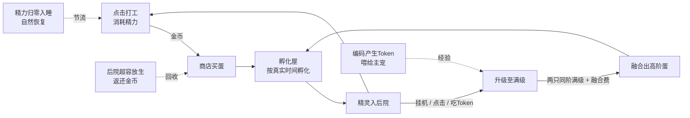

# Gulugulu 核心玩法设计文档（GDD）

> 版本 v1.0 · 2026-07-07 · 基于 `docs/gdd/CoreLoop.md` 的需求展开设计
> 数值均为可调常量，权威定义集中在 §9；对原需求的偏离与新增见 §14.1

## 1. 概述与设计目标

Gulugulu 从"单只咕噜鸭桌宠"升级为**桌面精灵养成游戏**：一个透明无边框置顶小窗里的宠物小精灵/数码宝贝风格世界。产品定位是**编码伴侣 + 精灵养成**——你写代码，它吃 Token 成长；你休息，戳它两下打工赚钱；你睡觉，蛋在后台照孵。咕噜鸭不再是唯一主角，而是六只初始精灵中"一般属性"的那一只（唯一沿用现有 PNG 帧动画的精灵）。

设计支柱：

1. **贴合编码场景**：三条成长途径（挂机/点击/吃 Token）分别对应"开着就行 / 摸鱼一下 / 认真干活"，混合玩最快，任何单一玩法也能到达终点（金币与经验两条进度都有保底来源，见 §5）。
2. **窗口即世界**：所有玩法在透明窗口内完成，零网页依赖；窗口尺寸随内容自适应——宠物区固定置顶、水平中心锚定，高度向下生长。
3. **轻数值、强反馈**：每个数值都有水龙头和水槽，精力是点击收入的节流阀，账号级软上限兜底防通胀；每次操作都有即时动效（飘字、弹跳、裂壳）。
4. **可替换的占位美术**：MVP 全部用 SVG 组件占位，锚点与现有 PNG 帧系统对齐，后续可无缝换成 AI 生成形象。

## 2. 核心循环

玩家点击精灵打工获得金币（消耗精力，精力归零则精灵入睡、只能等自然恢复）；金币在商店购买不同属性的蛋；蛋在孵化屋按真实时间孵化成精灵；精灵通过挂机、点击打工、吃 Token 三条途径升级；两只**同阶且满级**的精灵拖到一起融合成一颗高阶蛋，回到孵化环节，产出更高阶精灵。孵化屋升级扩容同时孵化数，后院升级扩容持有上限，超容需放生（返还部分金币）。



## 3. 精灵系统

### 3.1 六属性

一般、火、电、水、草、冰。MVP 不做属性克制战斗，属性只决定：初始精灵种类、蛋的价格与孵化时长、融合结果、SVG 主色与徽记。

### 3.2 六只初始精灵（1 阶）

> 2026-07 全阵容 SVG 重设计：一阶统一**新生儿比例**（头占比 ≥60%，团子型物种整只即一颗头），六只在体型/剪影/颜色上拉到最大差异；一般系元素色改黑白。codename 是存档外键**永不改名**（bubblefrog 现为鲸、frostpeng 现为雪怪）。每只带一件专属工作道具（白领办公/服务业/幻想三类各 2 件）。

| 属性 | 中文名 | 代号 | 主色 | 体型/剪影 | 工作道具 | 性格一句话 |
|---|---|---|---|---|---|---|
| 一般 | 咕噜鸭 | `guluduck` | 黑白（#2E2E36+白） | 小巧团子：三呆毛+扁嘴的大头水滴 | 💼笔记本电脑 | 换上黑白礼服的嘴硬奶鸭，口头禅"嘎？这合理吗？" |
| 火 | 炎尾狐 | `emberfox` | #E85D3A | 最高：大头奶狐+高过头顶的 S 形火焰尾（蜡烛剪影） | 🍮料理喷枪 | 急性子的高个子奶狐，火焰尾随情绪忽大忽小 |
| 电 | 啾雷鼠 | `voltmouse` | #FFD93B | 最小：掌心圆球+超大圆耳+折线闪电尾（整只是头） | 💼机械键盘 | 巴掌大的迷你雷鼠，兴奋时会把静电传给别人 |
| 水 | 泡泡鲸 | `bubblefrog` | #2E7BD6 | 最宽最圆：悬浮宽胶囊+尾鳍+头顶喷水柱（整只是头） | 🧹拖把 | 飘在半空的圆滚小鲸，喷水柱里装着今天的心情 |
| 草 | 芽芽菇 | `sproutcap` | #57B84C | 独特圆顶：占画面 2/3 的大伞帽+一小截菌柄 | ✨嫩芽魔杖 | 顶着比身体大三倍的菌帽，晒到太阳会左右摇摆 |
| 冰 | 霜霜雪怪 | `frostpeng` | #8FD8E8（青白系，禁纯白） | 最壮：锯齿毛边梯形+垂地大臂（毛边饭团） | ✨水晶雪球 | 毛茸茸的壮实小雪怪，高冷话少，最怕别人不理它 |

每只精灵是独立个体（有 id、等级、经验、精力）。**主宠**（"跟随中"精灵）显示在桌宠位，接收 Token 经验与主宠挂机经验；可在后院随时切换。

### 3.3 等级与三种成长途径

| 途径 | 换算 | 节流 |
|---|---|---|
| 挂机 | 主宠 1 exp/分钟；后院精灵 1 exp/5 分钟 | 仅应用在线时累计（由后端 60s tick 线程走表，见 §12.7；MVP 无离线挂机经验） |
| 点击打工 | 每次点击 +2 exp（发给被点击的精灵，与金币同发） | 受精力钳制 |
| 吃 Token | 账本口径：progress 侧累计 `experience` 每 +1（= 1000 tokens），主宠 +1 exp（增量结算，不丢余数，见 §12.4），保留现有 eat 动画与飘字 | 账号级日上限 300 exp（设计新增，见 §14.1）；溢出按 1 exp = 1 金币折算，日折币上限 200 |

**主宠满级时的 Token 经验去向**（保证 eat 动画永远对应可见收益）：自动转给后院中经验进度最低的未满级精灵；若全员满级，则按 1 exp = 1 金币折算（并入日折币上限 200）。主宠满级时 UI 气泡提示"我满级啦，换个伙伴跟着你吧"。

**等级曲线**：Lv n → n+1 所需经验 = `10 × n`。1 阶满级 **Lv10**（累计 450 exp）；2 阶满级 **Lv20**，所需 = `25 × n`（累计 4750 exp）。满级精灵卡片显示星标，是融合的前提。

**配比意图**：满级 450 exp ≈ 纯挂机 7.5 小时在线 ≈ 纯点击 225 次 ≈ 1~2 个编码日的 Token（被日上限压平）。编码时挂着（Token + 挂机），休息时戳两下，1~2 天自然攒出两只满级、达成首次融合。

**历史存量并轨**：存档首次创建时读取一次 `gulugulu-progress.json`，将**所有项目的 experience 求和**，一次性折算为 `min(总和, 200)` 金币的开局礼包；之后游戏只消费账本的增量——不改后端换算，不重算历史，字节偏移防重复机制原样保留。

## 4. 蛋与孵化系统

### 4.1 蛋的阶级

- **1 阶蛋**：商店购买，六种属性各一种，孵出对应初始精灵。
- **2 阶蛋**：不出售，仅由融合产出，孵出融合表对应的 2 阶精灵。
- **教学蛋**：开局免费预置在孵化槽的一般蛋，60 秒速成，保证 1 分钟内见到第一只精灵。

### 4.2 孵化时长（真实时间，离线照孵）

| 蛋 | 时长 |
|---|---|
| 教学蛋 | 60 秒 |
| 一般蛋 | 3 分钟 |
| 火 / 水 / 草蛋 | 5 分钟 |
| 电 / 冰蛋 | 8 分钟 |
| 2 阶蛋 | 30 分钟 |

孵化存绝对时间戳 `hatchAt`，关机照常孵，重启即时结算，不可加速（加速道具留待后续版本）。孵化完成的槽发光抖动，点击播裂壳动画收取；**后院满员时精灵留在槽内等待收取（占槽），提示先去后院放生腾位**。买蛋或融合产蛋时若无空槽，蛋进入库存，可稍后手动入槽（`place_egg`）。

### 4.3 孵化屋升级

| 等级 | 槽位 | 升级费 |
|---|---|---|
| Lv1 | 1 | 初始 |
| Lv2 | 2 | 200 金 |
| Lv3 | 3 | 800 金 |

## 5. 打工与精力系统

- **打工入口有两个**：① `uiMode = menu`（菜单已展开）时点击宠物本体 = 对主宠打工；② 后院界面直接点精灵卡片 = 对该精灵打工（卡片弹跳 + 金币飘字 + 精力条即时扣减），无需来回切换主宠。菜单未展开时点宠物是"摸头 + 弹菜单"（见 §10.2 的完整消歧规则）。
- **点击收益**：`1 + 等级 + 10 × (阶数 − 1)` 金币/次。1 阶 Lv1 = 2 金，Lv10 = 11 金；2 阶 Lv1 = 12 金，Lv20 = 31 金（跨阶单调递增，融合永不亏手感）。每次点击同时 +2 exp。
- **账号级日软上限**（防通胀，见 §8）：当日点击金币收入累计超过 1500 后收益减半，超过 3000 后降为 25%（`GameConfig` 可调；UI 在软上限生效时飘字变灰色并气泡提示"今天累了，明天再干吧"）。
- **精力**：每只精灵独立，上限 100，每次点击消耗 5（一管 20 次点击，约 30~60 秒主动操作）。
- **自然恢复**：1 点 / 6 秒，清醒、睡眠、离线同速（10 分钟回满一管）。用 `staminaUpdatedAt` 时间戳惰性结算，无 tick 无离线补偿逻辑。
- **精力归零**：强制进入 `exhausted` 态（复用现有 sleep 动画 + Zzz 气泡"累了，让我睡会儿…"），**仅打工点击无效**（有 Zzz 抖动反馈）；`pet` 态点击仍可弹菜单、逛商店、操作孵化屋——睡觉只锁打工，不锁 UI。恢复至 **≥60 自动醒**（约 6 分钟小睡，醒来至少能连点 12 次，避免高频睡醒循环把操作切得太碎）。
- **保底收入**（保证"没钱没精力"永远有出路，纯挂机路径的金钱进度与经验进度对齐在 2 天左右）：
  - 漫游捡币：主宠自主漫游结束时随机捡到 1~2 金币，日上限 50（复用现有漫游行为）。
  - 挂机产金：主宠在线每 10 分钟 +1 金币，日上限 50（随 §12.7 的 tick 线程结算）。

## 6. 商店系统

| 商品 | 价格 | 备注 |
|---|---|---|
| 一般蛋 | 80 金 | 孵出咕噜鸭 |
| 火蛋 / 水蛋 / 草蛋 | 各 120 金 | 孵出炎尾狐 / 泡泡蛙 / 芽芽菇 |
| 电蛋 / 冰蛋 | 各 150 金 | 孵出啾雷鼠 / 霜霜企 |
| 2 阶蛋 | 不出售 | 仅融合产出 |

初始金币 **50**。购买动效：金币数字滚动减少，蛋飞向菜单条孵化图标（有空槽直接入孵，否则入库存并 toast 提示）。钱不够的商品置灰。

## 7. 融合系统

**规则**：两只**同阶且满级**的精灵 + **100 金融合费**（融合费为超出原需求的设计新增，用于经济回收，`GameConfig` 可调、可设 0，见 §14.1）→ 消耗两只精灵，产出一颗 2 阶蛋（30 分钟孵化）。MVP 只做 1 阶 → 2 阶；2 阶 → 3 阶留待 v2（曲线已预留）。

- 允许消耗最后两只精灵（必得 2 阶蛋，不构成死局；若后院清空，桌宠位显示孵化中的蛋）。
- 融合产出的 2 阶蛋若无空孵化槽，进入库存并 toast 提示（复用 §4.2 的库存与 `place_egg` 机制），不阻塞融合操作。
- 原需求"由 AI 决定合成结果"在 MVP 落地为下面这张**设计期由 AI 产出的确定性 21 组合表**（键为排序后的 `"fire+ice"` 形式，天然覆盖无序对）；后续版本可接 avatar-gen 动态生成形象，表只锁定名字与属性。

> 2026-07 SVG 重设计：二阶形象 = 双亲签名件的**可见组合**（底座 rig 取体型更大的一亲、含"一般"的固定鸭底座；配件亲至少贡献 2 个签名件；部件配色对应双亲）。二阶统一**幼童比例**（头占比 40-50%，比一阶"长大了一点点"）。同元素融合 = 王族进化（放大 + 王冠/签名件翻倍）。codename 为不透明存档键，不随形象改名。

| 组合 | 结果精灵 | 代号 | 属性 | 视觉配方 | 工作道具 |
|---|---|---|---|---|---|
| 一般+一般 | 咕噜天鹅 | `guluswan` | 一般 | 鸭底座拉长脖颈；白身黑眼罩纹+黑飞羽+银灰小王冠 | 💼签字钢笔+文件夹 |
| 火+火 | 炎狱狐 | `infernofox` | 火 | 狐底座×1.2+三条火焰尾+眉间火苗冠 | 🍳中华炒锅 |
| 电+电 | 雷霆鼠皇 | `thunderking` | 电 | 鼠底座×1.25+静电王冠+双股闪电尾+红披风 | ✨雷神小锤 |
| 水+水 | 浪涛鲸 | `tidefrog` | 水 | 鲸底座×1.2+背驮浪花冠+双喷水柱 | 🛟救生圈 |
| 草+草 | 菇林兽 | `mycobeast` | 草 | 菇底座×1.25+帽上迷你蘑菇林+苔藓垂边 | ✨炼金大锅 |
| 冰+冰 | 极冰雪帝 | `glacierpeng` | 冰 | 雪怪底座×1.2+冰凌王冠+冰晶披风 | ✨冰霜权杖 |
| 一般+火 | 焰羽鸭 | `blazeduck` | 火/一般 | 白鸭+狐火焰尾+呆毛燃成三簇火苗 | 🍢烧烤串 |
| 一般+电 | 闪光鸭 | `sparkduck` | 电/一般 | 白鸭+鼠闪电尾+电花颊+黄锯齿翅纹 | 💼办公打印机 |
| 一般+水 | 涟漪鸭 | `rippleduck` | 水/一般 | 白鸭+鲸尾鳍+一根呆毛变小喷水柱 | 💼办公室饮水机 |
| 一般+草 | 苔羽鸭 | `mossduck` | 草/一般 | 白鸭+迷你菇帽+背苔藓斑+呆毛换嫩芽 | 🌸浇水壶 |
| 一般+冰 | 霜羽鸭 | `frostduck` | 冰/一般 | 白鸭+雪怪蓬毛围脖+冰凌小尾+青蓝霜斑 | 🍧刨冰机 |
| 火+电 | 电浆狐 | `plasmatanuki` | 火/电 | 狐+鼠大圆耳+火焰尾嵌闪电黄芯+电花颊 | 💼激光笔 |
| 火+水 | 蒸汽鲸 | `steamander` | 水/火 | 鲸+狐尖耳+尾鳍尖点火+喷水柱变蒸汽团 | 👔熨斗 |
| 火+草 | 余烬菇 | `cinderleaf` | 火/草 | 菇+帽面余烬橙+帽檐火线+柄后火焰尾（橙帽绿柄） | ✨余烬灯笼 |
| 火+冰 | 熔霜狼 | `thermowolf` | 火/冰 | 雪怪底座+狐耳/火焰尾；左半火纹右半冰纹硬分割 | 💼空调遥控器 |
| 电+水 | 雷雨鲸 | `stormeel` | 电/水 | 鲸+电花颊+闪电形尾鳍+头顶悬浮小乌云（黄鲸蓝肚） | ✨风暴魔杖 |
| 电+草 | 藤电鼠 | `vinevolt` | 电/草 | 鼠+头顶嫩芽+闪电尾缠藤蔓叶+绿叶斑颊 | 💼客服耳麦 |
| 电+冰 | 极光貂 | `auroramink` | 电/冰 | 鼠+雪怪蓬毛+耳内极光渐变+冰晶尾尖 | 💼数位板 |
| 水+草 | 莲叶鲸 | `lotusturtle` | 水/草 | 鲸+莲叶圆帽+喷水口长嫩芽+荷纹肚 | 🎣长柄捞网 |
| 水+冰 | 浮冰雪怪 | `floeseal` | 冰/水 | 雪怪+鲸尾鳍+波浪肚纹+脚下小浮冰 | ✨水晶球 |
| 草+冰 | 雪兔菇 | `frostbunny` | 草/冰 | 菇+毛绒帽檐+帽顶两撮兔耳形雪绒+冰凌垂檐 | ✨魔法毛线球 |

## 8. 后院与容量

| 等级 | 持有上限 | 升级费 |
|---|---|---|
| Lv1 | 3 只 | 初始 |
| Lv2 | 5 只 | 300 金 |
| Lv3 | 8 只 | 1200 金 |

- **放生**：后院选中精灵 → 放生（二次确认）→ 返还 `⌊对应蛋价 × 25%⌋ + 等级 × 5` 金币（**向下取整**；满级 1 阶一般 = 70 金 < 蛋价 80，满级电/冰 = 37 + 50 = 87 金 < 150——"刷蛋练满卖掉"永远不划算，防通胀）。**2 阶精灵的"对应蛋价"取 2 阶蛋等效价** = 两只材料蛋价之和 + 融合费 100（例：一般+一般 = 260，电+冰 = 400）。
- **防死局**：最后一只精灵禁止放生（融合例外，见 §7）；精力自然恢复 + 漫游捡币 + 挂机产金保证收入永不归零。
- **防通胀**：精力是**单只**节流阀（每只每日恢复 14400 点 ≈ 理论 2880 次点击/只，多只精灵会线性放大，账号级没有天然硬顶）；中后期点击收入可观——一只 Lv10 主宠活跃 2 小时约 260 次点击 × 11 金 ≈ 2860 金，2 阶 Lv20 更高。因此真正的闸门是 §5 的**账号级日软上限**（1500 全额 / 到 3000 半额 / 之后 25%，日实际上限约 3000 出头），与 MVP 水槽（升级合计 2500 金 + 蛋 + 融合费）量级匹配。v2 预留更大水槽：后院 Lv4（约 5000 金）、孵化屋 Lv4、3 阶融合费。Token 折币与保底收入均有日上限。

## 9. 数值总表（权威定义，全部集中在 Rust 侧 `GameConfig`）

| 参数 | 建议初始值 |
|---|---|
| 初始金币 | 50 |
| 开局赠送 | 1 颗教学蛋（已入槽，60s 孵化） |
| 历史 experience 并轨 | 首建存档时读一次 progress，全项目求和后折 `min(总和, 200)` 金币 |
| 蛋价 | 一般 80；火/水/草 120；电/冰 150 |
| 2 阶蛋等效价（仅用于放生返还） | 两只材料蛋价之和 + 100 |
| 孵化时长 | 教学 60s；一般 3min；火/水/草 5min；电/冰 8min；2 阶 30min |
| 点击收益 | `1 + 等级 + 10×(阶数−1)` 金币/次 |
| 点击收入日软上限 | 当日累计 >1500 后减半；>3000 后 25% |
| 点击经验 | +2 / 次 |
| 精力 | 上限 100；点击耗 5；恢复 1 点/6s（在线/离线/睡眠同速）；归零强制入睡，≥60 自动醒 |
| 挂机经验 | 主宠 1/min，后院 1/5min（仅在线，60s tick） |
| 挂机产金 | 主宠在线 1 金/10min，日上限 50 |
| 漫游捡币 | 每次漫游结束 1~2 金，日上限 50 |
| Token 经验 | progress 累计 experience 每 +1（=1000 tokens）= 主宠 1 exp；日上限 300；溢出与满级溢出 1exp=1 金，日折币上限 200 |
| 等级 | 升级需 `10×n`；1 阶满级 Lv10（累计 450）；2 阶满级 Lv20（`25×n`，累计 4750） |
| 融合 | 同阶满级两只 + 100 金（可调可 0）→ 2 阶蛋 |
| 孵化屋 | 1 槽 → 2 槽 200 金 → 3 槽 800 金 |
| 后院 | 3 只 → 5 只 300 金 → 8 只 1200 金 |
| 放生返还 | `⌊蛋价×25%⌋ + 等级×5`（2 阶用等效价） |

**节奏验证**（按本表参数逐分钟推演）：0~1 分钟教学蛋孵出咕噜鸭 → 一管精力 20 次点击边打边升级（Lv1×5 次 2 金 + Lv2×10 次 3 金 + Lv3×5 次 4 金）= **+60 金（50→110）** → 第 2~3 分钟买一般蛋（80 金）→ 3 分钟孵化，期间精力回补、约 6 分钟自动醒 → **10 分钟内两只精灵**，完成"孵化→打工→买蛋"正循环。白天编码 Token（300/日）+ 在线挂机（1/min）主宠当天满级；切主宠练第二只，**次日达成首次融合**（融合费 100 金由点击/溢出折币轻松覆盖），30 分钟后孵出 2 阶精灵作为里程碑奖励。

## 10. UI 与交互设计

### 10.1 窗口状态与尺寸表

顶层新增 `uiMode` 状态（独立于 `PetState`）。功能区打开时暂停漫游、睡眠计时与喂食出队（Token 仍后台累计），关闭后恢复。所有尺寸切换配 120ms 透明度过渡；**宠物区固定高度置顶、窗口水平中心固定：高度向下生长，宽度变化时左右对称扩展**（锚定策略见 §12.6）。所有玩法零网页依赖；**右键菜单中原有的 avatar-gen 网页入口在 MVP 移除**（严格满足"不再打开任何网页界面"，avatar-gen 服务保留在仓库供 v2 使用）。

| uiMode | 尺寸(逻辑px) | 内容 |
|---|---|---|
| pet | 260×320 | 现状桌宠 |
| menu | 260×396 | 桌宠 + 底部菜单条 + 精力/金币常驻条 |
| hatchery | 300×440 | 孵化槽纵向列表 |
| yard | 340×500 | 精灵网格 + 详情条 |
| shop | 320×470 | 2×3 蛋卡网格 |
| fusion | 340×440 | 双槽融合台 |
| status | 260×420 | 原状态面板扩展版（并入菜单） |

### 10.2 导航与点击消歧规则

左键点击宠物本体的语义按 `uiMode` 消歧（这是全文唯一权威定义，§5、§12.5 与此一致）：

- **`uiMode = pet`（菜单未展开）**：单击宠物 = 播现有 pet_head 摸头动画 + 在宠物下方滑出菜单条：`孵化屋 | 后院 | 商店 | 融合 | 状态`，另有精力条 + 金币数常驻显示（进入 `menu` 态）。原"状态面板"并入"状态"页。
- **`uiMode = menu`（菜单已展开、宠物可见）**：单击宠物 = **打工**（`user_work_click`，金币 + 经验 + 弹跳动效）。这样既满足原需求"左键单击 → 出现菜单"，又保留"点击精灵打工"的核心手感。
- **点功能图标**：上方宠物区（`.pet-stage` 插槽）切换为对应功能面板，菜单条常驻底部并高亮当前项；缩小版主宠头像留在菜单条上保持"它还在"的感觉（点头像 = 返回 `menu` 态）。
- **返回/收起**：点窗口空白处或 Esc 逐级返回（功能区 → menu → pet）；**不通过点宠物返回**（那是打工）。拖拽窗口走宠物身体或功能区标题栏。

```
默认+菜单(260×396)          后院(340×500)
┌──────────────┐        ┌────────────────────┐
│  (气泡/留白)   │        │ ← 后院 Lv1(3/3)  [金]128│ ← 标题栏可拖窗
│    [主宠]     │        │ ┌──┐ ┌──┐ ┌──┐     │
│──────────────│        │ │鸭│ │狐│ │+ │     │ ← 卡:SVG+Lv+精力条
│ 孵|院|店|融|态 │        │ └──┘ └──┘ └──┘     │   满级卡右上角星标
│ 精力▓▓▓░ 金128│        │ ┌选中详情──────┐    │
└──────────────┘        │ │炎尾狐 Lv3 精力80│    │
                        │ │[跟随][打工][放生]│    │
融合台(340×440)          │ └─────────────┘    │
┌────────────────┐      │ [升级后院 300金]      │
│ ← 融合台  [金]128│      │ 孵|院|店|融|态        │
│ ┌───┐   ┌───┐  │      └────────────────────┘
│ │ A │ + │ B │  │
│ └───┘   └───┘  │      孵化屋(300×440)：纵向槽列表，
│ ══候选(仅满级)══ │      蛋SVG+环形倒计时；完成槽发光
│ [鸭*][狐*][蛙]  │      抖动，点击播裂壳动画收取。
│ ┌预览: ? → 蛋┐  │
│ [融合 100金]    │      商店(320×470)：2×3蛋卡网格，
│ 孵|院|店|融|态   │      钱不够置灰；购买后蛋飞向
└────────────────┘      菜单条孵化图标。
```

### 10.3 融合拖拽交互

采用**槽位式拖放**（保留"拖到一起"手感，避免自由碰撞检测成本）：按住候选精灵 250ms 拾起（放大 1.1 倍跟手，pointer capture），拖入 A/B 槽吸附；双槽就绪时槽间闪电弧连线，预览区显示结果 2 阶蛋；非法组合（未满级/不同阶）槽位红闪抖动 + toast"需同阶满级"。确认后两精灵 SVG 螺旋汇聚 → 白闪 → 高阶蛋落入孵化屋（无空槽则入库存）。**另支持在后院长按满级精灵直接拖到另一只满级精灵上**，跳转融合台并预填双槽——这是对原始需求"拖到一起"的直觉入口。

### 10.4 反馈与新手引导

- 统一飘字复用 `.exp-pop-layer`：金币 +N（金色）、Exp +N（绿色）、"Lv UP!" 微闪；打工点击时精灵 scale(0.9→1.05) 弹跳。
- 四步引导（复用 speech 气泡样式）：① "点我一下试试" → 弹菜单；② 指向孵化屋"你的第一颗蛋在孵了"；③ 孵化完成"再点我就开始打工赚钱！精力用完我会睡一小会儿"；④ 攒够 80 金时商店图标红点"去买第二颗蛋"。每步完成写入 `tutorialStep`，10s 无操作自动收起。
- 精力归零：入睡 + Zzz + 气泡提示，杜绝无反馈困惑。

## 11. 美术规范（SVG rig 体系，2026-07 重设计后）

- **部件化 rig 装配**（不再是每精灵一个整体 SVG）：六个底座 rig（`src/sprites/rigs/`：duck/fox/mouse/whale/mushroom/yeti）× 前视+侧视 × baby/kid 两比例；签名件按元素分 kit（`src/sprites/kits/`），二阶通过槽位（tail/headTop/back/cheeks/marking/platform/tool）组合双亲签名件；27 行声明表在 `src/sprites/speciesTable.ts`（视觉数据不进 config.json，Rust 零耦合）。`SvgSprite.tsx` 是装配器。`viewBox="0 0 256 256"`，**底部中心锚点 (128, 233)**。config 的 `body` 字段是 rig 的不透明 ID（`frog`→鲸 rig、`penguin`→雪怪 rig）。
- **比例**：一阶=新生儿（头≥60%），二阶=幼童（头 40-50%）；描边 #3B2B1D（主形 6/中件 5/细节 4）；圆角垄断、尖角只给剪影签名件；一阶平涂禁渐变，二阶部件分色（仅极光貂一处渐变）。
- **动效**：CSS keyframes 作用于命名部件组（`sprites.css` 词汇表）——待机呼吸+眨眼、**移动切侧视 rig** 且腿部迈步（左右由 `.facing-left` 镜像）、工作挥专属工具（仅 working/laboring/success 淡入）、庆祝大跳、睡眠大幅压扁+Zzz、拖拽悬吊蹬腿、落地 splat 压扁回弹；**点击反馈是叠加层**（wrapper 压扁脉冲 + 元素色爆发粒子），不打断当前动画。所有循环动画首尾同姿势。
- **元素粒子层**：每元素一种粒子（一般=黑白四角星/火=火苗/电=闪电/水=气泡/草=叶/冰=雪花），强度分级（idle 2 粒、工作 4 粒、庆祝径向爆发、睡眠关闭）；二阶双元素左右分区发射；`prefers-reduced-motion` 下隐藏。单精灵 ≤8 环境粒子，全部 transform/opacity。
- 徽记（火=火苗、电=闪电、水=水滴、草=叶、冰=雪花、一般=四角星 star）保留为左上角身份标识。
- 蛋模板不变：白底蛋形 + 属性色斑纹（取 species colors，黑白鸭蛋即黑白斑）；2 阶蛋金边。
- **与 PNG 系统共存**：`isSvgStage` = 未选自定义头像时全物种走 SVG；用户右键选择 avatar-gen 导入的自定义头像时回退 `AnimationPlayer` PNG 帧（该链路及内置 guluduck manifest 保留不动）。SVG one-shot 状态时长见 `petEvents.svgStateDurationMs`（与 CSS 对齐；喂食队列依赖其模拟 onComplete）。
- **动画调试面板**：菜单栏"🛠 调试"（UiMode `debug`，340×560）——27 物种网格 + 全状态按钮 + 朝向切换 + 点击反馈演示 + 自动轮播，预览完全独立于真实事件。离线快照工具：`scripts/render_sprites.tsx`（react-dom/server → svg → resvg 转 PNG）。
- **动画归并**（2026-07）：打工=工作同一套（laboring 由 800ms 状态计时器退出）、力竭=睡眠同一套（无灰度差异）、被拎起=拖拽中同一套；调试列表只列 10 个去重状态。
- **睡眠=趴地构图**（`RigProps.pose="lie"`）：每个底座 rig 绘制专门的趴卧姿势（鸭=孵蛋趴窝、狐=蜷卧尾巴当围巾、鼠=大字趴耳朵耷拉、鲸=落地贴腹、菇=帽子滑下当被子、雪怪=前扑摊手），不是把站姿旋转倒下；CSS 只负责呼吸起伏 + Zzz。
- **点击游戏化（打工爽快感）**：工具粒子（`parts/workFx.tsx`，六个一阶各配一套与工具匹配的粒子与飘散方向）+ 连击系统（1.1s 窗口；粒子数/锥角/距离随连击增长；每 10 连击超级爆炸环）+ 透明收益弹出（图标+描边数字，冲击式弹出）+ 连击累计读数。**特效窗口扩张**：连击 ≥3 时透明窗口临时向左右各 +150、向上 +220 扩张并同步移位（内容 transform 平移回原位，玩家无感知），粒子解锁满屏扩散半径；停手 1.6s 后无感收回；与 uiMode/右键菜单的窗口尺寸逻辑互斥（切换前先收回）。

## 12. 技术实现要点

### 12.1 存档（`save_manager.rs` + `gulugulu-save.json`）

与 `gulugulu-progress.json` **分文件、单向依赖**：progress 仍是 token 事实账本（不动），save 只消费其增量。**仿 `SharedCodexState` 的 `Arc<Mutex<GameSave>>` + `.manage()` 常驻内存模式**（注意：不是 ProgressStore 的每次整读整写磁盘模式），每个写命令成功后整写 JSON 落盘。`#[serde(rename_all="camelCase")]`，`types.ts` 全量镜像（Rust↔TS 类型对等是仓库硬性规则）：

```rust
struct GameSave {
  version: u32,                    // =1，留迁移口
  coins: u64,
  pets: Vec<PetInstance>,          // id, species, element, tier, level, exp,
                                   // stamina, stamina_updated_at
  eggs: Vec<EggInstance>,          // id, species, element, tier,
                                   // slot: Option<u8>, hatch_at: Option<i64> // None=库存
  hatchery_level: u8,
  yard_level: u8,
  active_pet_id: Option<String>,
  last_seen_project_experience: BTreeMap<String, u64>, // Token 增量结算锚点（§12.4）
  daily: DailyCounters,            // date, token_exp, overflow_coins,
                                   // pickup_coins, idle_coins, click_coins
  tutorial_step: u8,
  last_seen_at: i64,               // 预留给 v2 离线挂机
}
```

### 12.2 配置单一来源

所有 §9 常量集中在 Rust 侧 `game_config.rs` 的 `GameConfig`（含 `fusion_table`，键为排序后的 `"electric+fire"`；含日上限与软上限阈值），前端经 `get_game_config` 拉取，禁止两侧硬编码复制。

### 12.3 新增 IPC 命令（注册进 `generate_handler!`，共 12 个）

所有校验（钱、槽位、同阶满级、后院容量、日上限）在 Rust 做；写命令返回**完整新 `GameSave`**，前端整体 setState，避免双侧状态漂移：
`get_game_state`（含启动结算）、`get_game_config`、`click_work(pet_id)`、`buy_egg(element)`、`place_egg(egg_id, slot)`、`collect_hatched(egg_id)`、`fuse_pets(id_a, id_b)`、`upgrade_hatchery`、`upgrade_yard`、`release_pet(pet_id)`、`set_active_pet(pet_id)`、`resize_game_window(w, h)`。

### 12.4 Token 接入点（与 codex_adapter 的关系）

**口径：按 progress 账本的累计 experience 增量喂宠，不用逐事件 delta。** 现有代码中逐事件 `experience_delta = token_delta / 1000` 是整数除法，单次不足 1000 tokens 的事件产生 0 并丢弃余数，而 agent 会话大量事件是小额增量，逐事件口径会系统性少喂；账本侧 `project.experience = total_tokens / 1000` 按累计算、不丢余数。因此 `GameSave` 按项目记录 `last_seen_project_experience`，`codex_adapter.rs::apply_agent_token_event()` 结算完 progress 后，用 `project.experience − last_seen` 的差值调 `save_manager::feed_active_pet(diff)`（内部执行日上限 300、满级转移与溢出折币，见 §3.3），并把 `petExpDelta` 附在现有 `codex://activity` 事件负载里推给前端——不开新事件通道；前端保留现有 eat 动画、喂食队列与飘字。历史存量折币在存档首次创建时执行一次（§3.3）。

### 12.5 状态机扩展（与 petEvents 的关系）

- 顶层 `uiMode: 'pet'|'menu'|'shop'|'hatchery'|'yard'|'fusion'|'status'`（7 个），独立于 `PetState`。`uiMode !== 'pet'` 时短路漫游 useEffect、暂停睡眠计时器与 `startNextFedIfReady` 出队；`petState` 机器语义不改。
- `PetState` 新增 `laboring`（点击打工瞬态 800ms，SVG 弹跳/guluduck 复用 pet_head）与 `exhausted`（映射现有 sleep 动画）。现有 `working` 语义是 agent 活动，**不复用**。
- **点击消歧**（与 §10.2 一致）：`handlePointerUp` 的点击分支按 `uiMode` 分发——`pet` 态派发 `user_click`（摸头 + 展开菜单条，原 `showStatusPanel` 逻辑并入状态页）；`menu` 态派发 `user_work_click → laboring`。
- **新增 PetState 的完整改动面**（不止两行映射）：`types.ts` 的 `PetState`/`PetEventType`、`petEvents.ts` 的 `stateAnimationMap`（`Record<PetState, AnimationKey>` 全量映射，缺项编译失败）与可选 `transientStateDurationMs`、`App.tsx` 的 `speechContextTags`（同为全量 Record）都要补齐；并把 `exhausted` 加入两个现有定时器的排除名单——"非 idle 状态 5 秒打回 idle"的 transient 超时 effect 和 `SLEEP_TIMEOUT_MS` 的入睡 effect（否则 exhausted 会被错误转成 sleeping），唤醒改由精力结算 ≥60 驱动。

### 12.6 窗口动态尺寸

**现状勘误**：现有右键菜单从前端 JS 调 `getCurrentWindow().setSize()`，但 `capabilities/default.json` 只授予 `core:default`、`allow-outer-position`、`allow-set-position`、`allow-start-dragging`——**缺 `core:window:allow-set-size`，该调用实际一直被 ACL 拒绝**，且被 `.catch(() => undefined)` 静默吞掉，并非已验证路径。

**方案**：动态尺寸统一走 Rust 命令 `resize_game_window(w, h)`（后端 `window.set_size()` 不经前端 ACL，无需改 capabilities；顺带把右键菜单的窗口扩展迁到同一命令）。前端实现 `useWindowAutoSize` hook：新增一个**由内容撑开高度的测量根节点**供 `ResizeObserver` 观察（不能观察 `.pet-shell`——它是 `100vw/100vh` 的视口盒，尺寸永远等于窗口；同时移除 `baseWindowSize` 内联钉死），120ms 防抖后调命令，minWidth/minHeight 钳制在 Rust 侧处理。

**锚定策略（已定）**：**顶边固定 + 水平中心固定**。高度变化只向下生长，无需位置补偿（Tauri 的 set_size 保持左上角不动、向下扩展，天然吻合）；宽度变化（260↔300↔320↔340）时在 `resize_game_window` 命令内由 Rust **配对调用 `set_position` 将 x 平移 −Δw/2**，保持窗口水平中心与宠物屏幕位置不动（set_size 与 set_position 在同一命令内先后执行，避免前端两次往返造成的抖动）。配套布局改动：`.pet-shell` 现有 `grid-template-rows: auto 1fr auto` 中宠物所在的 `1fr` 行改为固定高度 320px（否则窗口变高时宠物随 `1fr` 拉伸下移）。

**实现首日检查点**：`tauri.conf.json` 当前 `resizable: false`，Tauri 2 下程序化 `set_size` 一般不受其影响，但这是方案成立的前提，须第一时间实测；若受限，后备方案是配置改 `resizable: true`（无边框窗口无拖拽边框，用户仍无法手动缩放）。

`isTauri()` 为 false（浏览器预览）时 hook 空转，详见 §13 对预览模式的验收降级。

### 12.7 时间结算（两种机制，各司其职）

- **孵化与精力：绝对时间戳，无 tick**。孵化存 `hatchAt`，`now >= hatchAt` 即可收取，关机照常孵；精力按 `staminaUpdatedAt` 惰性计算 `min(100, stamina + elapsed/6s)`，写操作前先结算再扣。
- **在线挂机经验与挂机产金：Rust 侧 60s tick 线程**（仿现有 watcher 线程模式）。每 tick 给主宠 +1 exp（后院每 5 tick +1）、每 10 tick 主宠 +1 金（受日上限），写入 save 并通过事件推送前端刷新。线程只在应用运行时存在，天然满足"仅在线累计"；MVP 无离线挂机经验（`last_seen_at` 留给 v2）。

### 12.8 与 avatar_manager 的关系

内置 guluduck manifest 与自定义头像**安装**流程不动；六只新精灵与 21 只融合体作为 `renderer: 'svg'` 的内置条目注册。**右键菜单中打开 avatar-gen 网页的入口在 MVP 移除**（§10.1）；avatar-gen 服务与 `install_avatar_from_url` 能力保留在仓库，v2 用它为融合体动态生成形象。

## 13. MVP 范围与验收标准

**做**：六初始精灵 + 21 融合体的 SVG（融合体程序化占位）；`save_manager.rs` 全套 + 12 个 IPC + `GameConfig`；教学蛋开局；商店 6 种蛋；孵化屋 Lv1-3 / 后院 Lv1-3 与放生；点击打工 / 精力 / 强制睡眠 / 日软上限；三途径经验与 Token 并轨（含日上限、满级转移与历史折币）；1→2 阶融合（21 结果全表 + 槽位拖放 + 后院拖拽入口）；菜单 + 7 个 uiMode（pet/menu/hatchery/yard/shop/fusion/status）+ 自适应窗口；四步引导；漫游捡币与挂机产金；孵化/精力离线时间戳结算 + 60s tick 线程。

**不做**：3 阶及以上、属性克制战斗、加速道具、离线挂机经验、2 阶专属美术、avatar-gen 动态融合形象（入口一并移除）、音效、精灵社交。

**验收 checklist**：
1. 全新用户 15 分钟内完成"教学蛋孵出咕噜鸭 → 点击打工 → 买第二颗蛋 → 孵出第二只"。
2. 1~2 天正常使用（编码 + 碎片点击）达成两只满级 → 融合 → 30 分钟后孵出 2 阶精灵。
3. 精力归零入睡有明确反馈，恢复至 ≥60 自动醒来可继续；最后一只精灵无法放生。
4. 编码时 Token 正常转化为主宠经验（主宠满级时正确转移/折币），eat 动画与飘字保留；重启不重复计数。
5. 关闭应用 10 分钟再开：孵化进度、精力恢复按真实时间正确结算。
6. 窗口尺寸随各功能区正确伸缩，宠物区置顶、水平中心不漂移；全程无任何网页界面（含右键菜单）。
7. `npm run build` 与 `cargo build` 通过；浏览器预览模式（isTauri=false）下各 uiMode 界面可打开、SVG 精灵可渲染（用静态 mock 数据展示；**不要求数值循环可玩**——游戏规则单一来源在 Rust 侧，不在 TS 复制一遍）。
8. 实现首日验证 §12.6 检查点：`resizable: false` 下 Rust `set_size` 生效。

## 14. 需求追踪与偏离说明

### 14.1 对原需求的偏离与设计新增（提请确认）

| 项 | 性质 | 理由 | 默认处理 |
|---|---|---|---|
| 融合费 100 金 | 新增（原需求只要求"两只满级同阶"） | 给金币加长线水槽，防通胀 | `GameConfig` 可调，可设 0 |
| Token 经验日上限 300 + 溢出折币 | 收窄（原需求"吃 Token 升级"无限制） | 防止重度编码单途径碾压其它玩法；溢出折币保证收益不清零 | `GameConfig` 可调，可放宽 |
| avatar-gen 右键菜单入口移除 | 收紧执行（原需求"不再打开任何网页界面"） | 字面满足需求 | MVP 移除，服务保留供 v2 |
| 融合"拖到一起"→ 槽位式拖放 + 后院直拖 | 等效落地 | 小窗口内自由碰撞检测成本高；后院直拖保留原始手感 | 见 §10.3 |
| 挂机经验仅在线累计 | 界定（原需求"挂机"未说明离线） | MVP 简化；离线挂机留 v2（`last_seen_at` 已预留） | 见 §12.7 |

### 14.2 需求追踪表（CoreLoop.md 逐条覆盖）

| CoreLoop.md 需求 | 落点章节 |
|---|---|
| 精灵蛋：孵化需时间，完成后变精灵 | §4.1 / §4.2 |
| 精灵：点击打工赚钱、耗精力、归零睡觉、自然恢复 | §5 |
| 商店：用钱买不同属性的蛋 | §6 |
| 精灵等级：挂机 / 点击 / 吃 Token 提升 | §3.3 |
| 精灵融合：两满级同阶拖到一起 → 高阶蛋 → 融合体 | §7 / §10.3 |
| 孵化屋：可升级，决定同时孵化数 | §4.3 |
| 后院：可升级，决定持有上限，多出放生 | §8 |
| 6 种属性（一般/火/电/水/草/冰） | §3.1 |
| 六属性各一初始精灵，1 级蛋孵出 | §3.2 / §6 |
| 所有操作在透明窗口内，不开网页 | §10.1 / §12.6 / §14.1 |
| 左键单击宠物 → 下方完整游戏菜单 | §10.2 |
| 点功能 → 上方宠物区切换为操作区 | §10.2 |
| 窗口大小随内容改变 | §10.1 / §12.6 |
| 宠物小精灵 / 数码宝贝题材 | §1 / §3 / §7 |
| 鸭子降为宠物之一 | §3.2 |
| MVP：六个基础宠物 | §3.2 / §13 |
| 两两合成（由 AI 决定结果） | §7（MVP=设计期 AI 产出的确定表；v2 接 avatar-gen） |
| 基础孵化/点击/升级/融合/商店循环 | §2 / §13 |
| 形象先用 SVG 占位 | §11 |
| 保证基础循环可正常玩 | §9 节奏验证 / §13 验收 |
