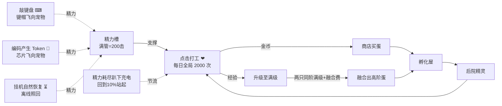

# Gulugulu 交互经济设计文档（点击成长 · 精力体系 · 键盘充能）

> 版本 v2.0 · 2026-07-14 · 取代 `CoreGameplay.md` v1.0 中 §3.3（三种成长途径）与 §5（打工与精力）的全部规则；`CoreGameplay.md` 已同步修订为 v1.1 并指向本文
> 数值均为可调常量，权威定义集中在 §8；对新需求的逐条映射与设计新增见 §10

## 1. 概述与设计目标

v1.0 的三条并行成长途径（挂机 / 点击 / 吃 Token）让成长大量发生在后台：宠物"自己就长大了"，点击沦为副业，Token 喂食的收益也无从感知。本次重构把体验收拢成一条清晰主线：

> **AI 干活喂饱精力，你亲手点击变成长。**

三个系统角色：

| 角色 | 系统 | 一句话 |
|---|---|---|
| **燃料** | 精力（三种来源：挂机 / 吃 Token / 敲键盘） | 你工作，它充电 |
| **转化器** | 点击打工（唯一的经验与金币来源） | 成长永远发生在你手里 |
| **节拍器** | 每日全局 2000 次点击额度 | 今天的爱有额度，明天还想继续 |

设计支柱：

1. **成长必须亲手发生**：经验与金币只从点击进入游戏，被"每日额度 × 精力"双重约束；挂机、Token、键盘只产精力，精力自封顶（上限即满管）。任何后台行为都不再直接产出成长。
2. **一切数值变化看得见飞进来**：新视觉语法——**向内汇聚 = 获得精力**（Token 芯片、键帽飞向宠物），**向外发散 = 产出收益**（金币/经验飘字、工具粒子）。两个方向永不混用。
3. **上限与恢复期用"爱与休息"叙事**：额度是"今天能给它的爱"，恢复期是"趴着充电"；全程不出现红色禁止、错误提示或惩罚感。
4. **品阶即身价**：越高阶的宠物，喂饱它越贵（恢复需求 ×5/阶），但每一击的回报也越高（点击收益 ×5/阶）——同一份日额度，投给谁是玩家的分配策略。

## 2. 核心循环

孵化 / 商店 / 融合 / 后院 / 放生等外围循环不变（见 `CoreGameplay.md` §4/§6/§7/§8）。

## 3. 精力体系

### 3.1 精力 = 点击次数

- 每只精灵独立精力，上限 `staminaMax = 200`，**每次点击消耗 1 点**（`staminaPerClick = 1`）——满管精力恰好支撑 200 次点击，精力条即"剩余点击次数"，无需换算。
- 精力按 `staminaUpdatedAt` 时间戳惰性结算（清醒 / 睡眠 / 离线同速回复），无 tick 依赖；时间戳晚于当前时刻时钳回（时钟回拨防呆）。

### 3.2 10% 迟滞唤醒

- 精力打到 **0**：进入 `exhausted` 恢复期——趴下充电（lie 姿态 + 💤 + 内嵌恢复进度条），**拒绝打工点击**（有温柔的驳回演出，非报错）。
- 恢复到 **≥ 10%**（`wakeThreshold = 20`）：站起、恢复接受点击（伸懒腰唤醒演出）。
- 两个阈值构成迟滞区间：醒着时精力从 200 → 1 全程站立可点；只有真正打空才休息，且每次醒来至少有 20 击可用，避免高频睡醒循环。
- 恢复期间**仍然进食**：Token 芯片与键帽照飞照吸收，喂到 ≥20 会直接被"喂醒"。

### 3.3 恢复三途径与品阶缩放

统一缩放系数 `tierFactor(tier) = tierGrowthFactor^(tier−1)`，`tierGrowthFactor = 5`。回满一管（200 点）所需：

| 途径 | 换算（每 1 点精力） | 1 阶回满 | 2 阶回满 | 3 阶回满（预留） |
|---|---|---|---|---|
| 挂机自然恢复 | `staminaRegenSecondsBase(3s) × tierFactor` | **10 分钟** | 50 分钟 | ~4.2 小时 |
| 敲键盘 | `keysPerStaminaBase(1) × tierFactor` 次按键 | **200 键** | 1000 键 | 5000 键 |
| 吃 Token | `tokensPerStaminaBase(10) × tierFactor` tokens | **2000 tokens** | 1 万 tokens | 5 万 tokens |

- 三途径**叠加生效**，键盘与 Token 的小数进度存在每宠整数缓冲（`keyBuffer` / `tokenBuffer`），不丢余数。
- 高阶宠"胃口大"是刻意的身价设计：想持续点 2 阶（每击 5 倍收益），要么认真写代码（Token 快），要么等它慢慢回。

### 3.4 能量喂养目标与溢出

键盘与 Token 的精力**优先喂主宠**；主宠满了，溢出流向**当前精力最低的未满宠**（并列按 id 决平，逐只灌满）；全员满管后剩余量**丢弃**（UI 轻提示"精力已满"，不折算金币——金币只能来自点击）。挂机恢复各宠独立结算，不参与转移。

### 3.5 漫游零食（原漫游捡币改造）

主宠自主漫游结束时不再捡金币，改为捡到**能量零食**：主宠 +`wanderSnackStaminaMin~Max`（2~5）点精力，日上限 `wanderSnackDailyCap = 20` 点。保留"桌宠乱跑有惊喜"的趣味，同时遵守"金币只来自点击"的铁律。

## 4. 点击成长

### 4.1 收益公式（唯一的经验与金币水龙头）

每次有效点击（消耗 1 精力）同时结算：

| 产出 | 公式 | 1 阶 | 2 阶 |
|---|---|---|---|
| 经验 | `clickExpBase(2) × tierFactor` | 2 / 击 | 10 / 击 |
| 金币 | `(clickCoinsBase(1) + clickCoinsPerLevel(1) × 等级) × tierFactor` | Lv1=2，Lv10=11 | Lv1=10，Lv20=105 |

- 满级精灵的点击不再产经验，金币照发（图鉴保底手感），仍计入日额度。
- 原 `clickCoinsPerTier`（+10/阶的加法项）与点击金币日软上限（1500/3000 减半/减 75%）**移除**——防刷职责由日额度统一承担。

### 4.2 每日额度（全局 2000 次）

- `dailyClickCap = 2000`：**账号级**每日有效点击总数，跨宠共享，由玩家自由分配（存档 `daily.clicks` 计数，本地日期翻转清零）。
- **计数规则**：每一次消耗精力的点击都 +1（含满级宠的纯金币点击）。
- **额度用尽后 = 纯抚摸模式**：点击不消耗精力、无任何数值产出，只播粉色爱心特效与温馨气泡（"今天被爱得饱饱的"）。不禁点、不报错。
- 额度体量参照：2000 击 ≈ 10 管精力 ≈ 满额约可点满 8 只 1 阶（各 225 击）或 2 只 2 阶（各 950 击）——上限宽裕，真实节流是精力循环与玩家耐心；2000 是防自动连点器的硬顶，不是日常体感墙。

### 4.3 等级曲线

`levelExpFactor = [10, 50]`（原 `[10, 25]`），`maxLevel = [10, 20]` 不变：

| 阶 | 升 Lv n+1 需 | 满级累计 | 换算成点击 |
|---|---|---|---|
| 1 阶 | `10 × n` | 450 exp | ≈ **225 击**（一管多一点） |
| 2 阶 | `50 × n` | 9500 exp | ≈ **950 击**（约半天额度） |

一只 2 阶从融合到满级的全程 ≈ 两只 1 阶（450 击）+ 融合 + 950 击 ≈ 1400 击，一个认真的游戏日可完成。

### 4.4 经济不变量与 Steam 合规

- **不变量**（进代码注释与单测）：`exp` 与 `coins` 只在 `logic_click_work` 中增加，且必经 `dailyClickCap` 与精力双重闸门；`logic_feed_energy` / `settle_pet` / 零食只改精力与缓冲，绝不触碰 `coins`/`exp`。
- 金币仍是**纯本地货币**，符合 `plans/steam_trade/00-decisions.md` 安全不变量：可交易宠物供给仍只来自 Steam playtime 掉落与融合销毁，本次重构未新增任何可交易资产水龙头（相比 v1.0 反而减少了金币水龙头：4 个 → 1 个）。
- **遗留旗标**：保留等级加成后，2 阶满级理论日收入上限 ~21 万金，现行商店物价（蛋 80–150 / 升级 200–1200 / 融合 100）需要后续单独调价 pass——本期不动物价，先观察真实收入曲线。

## 5. 键盘充能（新玩法）

### 5.1 规则

- **系统级监听**（Windows 低级键盘钩子，应用不聚焦也生效——玩家在编辑器里打字，宠物在旁边"接住"每个键）：每次按键下压计 1 次，按 §3.3 换算成精力喂给主宠（溢出转移同 §3.4）。
- **防刷三闸**：① 按住不放的自动重复不计（pressed-set：一次按下只计一次，直到抬起）；② 计数限速 `keyRateCapPerSec = 15` 次/秒（令牌桶，超出的键既不计数也不出特效）；③ 精力自封顶——即使无限敲键，成长仍被点击额度锁死。
- **事件节拍**：按键标签每 250ms 批量推给前端做键帽特效；精力每 1s 结算入账一次。
- 输入法（IME）兼容：按物理键位去重，中文输入连打每键照计；无法识别的键显示 ⌨ 通用键帽。

### 5.2 隐私承诺（写入 README 与设置页）

- **只统计次数**：游戏逻辑只接收"这 1 秒按了 N 次键"的计数。
- **瞬时字符只用于特效**：按键字符仅在 ≤250ms 的批次内存在、用于渲染飞行键帽，**不写日志、不入存档、不落盘、不上传**。
- **随时可关**：托盘菜单"键盘充能"勾选项一键关闭 = 真实卸载系统钩子（非静默忽略）；开关状态持久化在本地设置文件。默认开启（核心恢复机制），首次运行以引导气泡告知。

### 5.3 平台范围

Windows 首发（与 `window_tracker.rs` 同款平台门控先例）；macOS / Linux 暂不装钩子（该平台恢复途径 = 挂机 + Token + 零食），浏览器预览模式以页面内按键模拟等价逻辑。

## 6. 表现层规范

### 6.1 精力条（EnergyBar，四表面）

以现有菜单精力条（`.hud-stamina-*`）为母本抽出通用组件，变体 `hud / tag / float`：

- **色阶**：≥60% 绿（现绿渐变）；10–60% 橙（`is-low` 渐变，阈值从 25% 提到 60%，长管更早出现"过半"体感）；<10% 恢复期灰紫 + 填充端头呼吸微光（"正在充电"而非"死了"）。
- **10% 唤醒刻度**：轨道内竖向刻痕，位置 `wakeThreshold/staminaMax`；恢复期填充逼近刻度时闪烁（"快醒了"）。
- **获得脉冲**：键盘/Token/零食入账时条身亮白一跳；点击的 -1 不做逐击动画（只靠宽度过渡自然缩短）。
- **不常态显示（2026-07-14 修订）**：桌宠位（主窗口菜单收起）与后院里精力条**默认不显示**，保持画面干净；仅在**点击某宠 / 该宠精力入账**后短暂显示 ~2.6s 再淡出（后院驻留名牌与主角头顶浮条都走这条规则，一次只显示被交互的那只）。恢复期（趴卧充电）是例外：由 💤 充电药丸内嵌微条持续显示充电进度。
- **三个表面**：① 菜单 HUD 常驻条（菜单本身即"点击后"的管理视图，含刻度+脉冲+爱心计）；② 后院驻留伙伴名牌内嵌微条（点击该宠后短暂显示；满格时名牌图标换 ⚡ 作常态一瞥）；③ 后院主角头顶浮条（点击/入账后短暂显示）。主窗口桌宠位不再有常驻浮条——点击即开菜单，由 HUD 条呈现。

### 6.2 爱心计（每日额度呈现）

- 心形轮廓 + 底部向上液面填充，液面 = 剩余额度比例；>50% 粉红 / 10–50% 蜜橙 / <10% 暖金心跳 / **0 = 🌙 月亮徽章**（tooltip「今日的爱已点满 2000/2000」）。
- 位置：后院左下牌簇加一枚爱心牌（`❤ 1,240` 剩余数）；公告板「⚡ 今日 Token」行改为「❤ 今日点击 n/2000」；主窗口菜单 HUD 金币旁（仅图标+液面，数字进 tooltip）。
- 第 2000 击：全屏粉色心形彩带 + 爱心计翻转成月亮 + 气泡「今天的爱点满啦！剩下的明天继续💛」。**无金币奖励**（防通胀）。

### 6.3 汇聚飞行系统（FlightLayer，Token 能量饭团 / 键帽雨共用）

- **Token 能量饭团三幕（2026-07-14 重做，慢而明显 ~3s）**：Token 回复是一次性大量回复，动画刻意放慢、放大，让玩家看清。① 从远处飘来一个**能量饭团（🍙 SVG）**（主窗口左上"从 Agent 的话里掉出来"，后院从上方飘入）→ ② 抛物线 **~1.9s** 慢慢汇聚到**嘴部**（双层：外层水平线性、内层垂直先扬后坠）→ ③ 飘到嘴边**缩小消失**，同帧宠物做**夸张吃相**（`is-eating` 大口一咬→咽下→满足回弹，叠加 fed 咀嚼 ~1.7s）+ `+N 精力` ⚡飘字 + 精力条脉冲。合餐：待播队列一次合并成一餐。
  - **食物体型按 token 量指数分档**（越多 token = 越大的一餐）：`≤2k` 1 级 / `≤8k` 2 级 / `≤32k` 3 级 / …… ×4 每级，封顶 6 级；像素尺寸随级放大，高级加芝麻点缀与热气。
- **键帽雨（2026-07-14 调慢调近）**：复用 voltmouse 键帽原语（圆角矩 + 字符），从底边"从你的键盘跳出来"，**距离更短、速度更慢（~760–920ms）**飞到宠物身体中心偏上，便于看清键帽上的字符；落点化一颗 ⚡ 火花（键帽是"吸收"不是"吃"，不走嘴）。批内 95ms 错峰起飞；每批渲染 ≤6 枚（第 6 枚为堆叠键帽 + `×N` 角标），全局在飞 ≤12（超限最老一枚直接跳到落点火花）；每批只出一条合并 `+N 精力` 飘字。
- **风味键**：Enter `⏎` 1.35× 金面键帽 + 落点小星爆；Space `␣` 加宽键帽飞行 wobble；Esc 半程化烟（精力照算）；Backspace `⌫` 落点灰色小 poof。
- **打字风暴**：≥8 键/s 持续 3s → 宠物切 `working` 敲打姿态"陪你写代码"（全复用现有工作动画，零新增 rig），跌破 4 键/s 2s 后回落；恢复期不触发（键帽照飞，呼吸加深一拍"睡着也在吸收"）。
- 窗口隐藏时跳过特效（精力照算），恢复可见时一次补账脉冲。

### 6.4 姿态微演出

| 时刻 | 表现 |
|---|---|
| <10% 恢复期 | lie 趴卧 + 💤 药丸内嵌微型精力条（与夜间睡觉区分：夜睡无条无灰度） |
| 恢复到 10% 唤醒 | CSS 伸懒腰（身体 scaleY 1→1.07→1 + 双臂张开）+ ❗ 气泡 + 台词「睡饱啦！精力满上来了⚡」；后院伙伴同刻欢呼一次 |
| 满格邀约 | 头顶偶发金色 twinkle + 每 ~20s 自发小跳 + 名牌 ⚡满 徽标——充满电的宠物自己喊"点我" |
| 点击趴卧宠（驳回） | 翻身微动 + Zzz 放大一拍 + 气泡「嘘…让我睡会，快满 {n}% 啦」；**无粒子无飘字无报错** |
| 额度用尽后点击 | 纯爱抚：粉心 ReactionBurst + 轻微脉冲，每 ~15 击随机温馨气泡；无数字无连击 |

### 6.5 200 击长管节奏

原节奏为 20 击/管调校（每 10 连击 boom + 管末小跳），200 击下头重脚轻。重构为四级（以 `staminaMax − stamina` 存档值触发，跨会话稳定）：

| 里程碑 | 演出 |
|---|---|
| 每 10 连击 | boom 冲击环（现有，不变） |
| 50 / 100 / 150 击 | 精力条橙光扫过 + screen 级 boom + 宠物半跳 + 段落横幅「50 击！」「过半啦！」「最后冲刺！」 |
| 第 200 击（管空） | 大终结技：finisher 跳 + 三连 boom 错峰（0/0.12/0.26s）+ 精力条碎裂散星 + **收工结算横幅**「满工收工！本管 🪙+N ✨+N」（管级累计器）+ 缓缓趴下 |
| 连击视觉曲线 | 粒子密度上限保留，`--combo-scale` 封顶从 20 连击放宽到 40 |

人体工学：后院点击改 **pointerdown 即结算**（体感 -60ms，连点更跟手；主窗口保留 pointerup 以消歧拖拽）；**不做** hold 自动连点（违背"点击才有意义"）；200 击 ≈ 40–50s 连点，由 50 击段落 + 键帽雨/Token 餐穿插切成 4 段心理单元。

### 6.6 多宠一瞥

后院牌簇加一行「⚡ N 只精力满」，点击镜头平移到最近的满格伙伴；配合名牌 ⚡ 徽标，多宠精力管理一眼可读。

### 6.7 性能红线

全部飞行动画仅 `transform/opacity`；在飞键帽 ≤12、Token 芯片 ≤2；`prefers-reduced-motion` 降级为直出飘字；`document.hidden` 零渲染只补账。

## 7. 玩法完善路线

- **P1（下迭代）**：满格开点的前 20 击金色描边光环（纯表现无数值）；每日首击仪式（大心形 + 「早安！今天也有 2000 下的爱」）；Token 餐 S/M/L 完整化；图鉴/名牌 tooltip「今日已投入 n 击」（需 per-pet 日计数字段）。
- **P2（点子池）**：桌面级键雨（复用 fx 覆盖层按需显示，键帽从屏幕物理底边飞向宠物窗口）；夜间 22:00–7:00 睡帽；500/1000/2000 日击纯装饰彩带；后院"按住拖蹭"揉搓手势（原型验证后再排期）。
- **明确不做**：hold 自动连点（伤"点击才有意义"）；额度倒计时数字常显（焦虑感）；恢复期全屏灰罩（惩罚感）。

## 8. 数值总表（权威定义，全部集中在 Rust 侧 `GameConfig`）

| 参数 | 键 | 正式值 | 测试值 |
|---|---|---|---|
| 阶乘数 | `tierGrowthFactor` | 5 | 5 |
| 精力上限（=满管点击数） | `staminaMax` | 200 | 20 |
| 每击耗精力 | `staminaPerClick` | 1 | 1 |
| 挂机恢复基准（秒/点，×tierFactor） | `staminaRegenSecondsBase` | 3 | 1 |
| 唤醒阈值（10%） | `wakeThreshold` | 20 | 2 |
| 点击经验基准（×tierFactor） | `clickExpBase` | 2 | 2 |
| 点击金币 | `clickCoinsBase` + `clickCoinsPerLevel`，`(1+1×等级)×tierFactor` | 1 + 1 | 1 + 1 |
| 每日点击额度（全局） | `dailyClickCap` | 2000 | 30 |
| 键盘换算基准（键/点，×tierFactor） | `keysPerStaminaBase` | 1 | 1 |
| 键盘计数限速（次/秒） | `keyRateCapPerSec` | 15 | 5 |
| Token 换算基准（tokens/点，×tierFactor） | `tokensPerStaminaBase` | 10 | 2 |
| 漫游零食精力 | `wanderSnackStaminaMin/Max` | 2 / 5 | 1 / 2 |
| 漫游零食日上限（点） | `wanderSnackDailyCap` | 20 | 5 |
| 等级曲线（升 Lv n+1 = factor×n） | `levelExpFactor` | [10, 50] | [2, 3] |
| 满级 | `maxLevel` | [10, 20] | [4, 6] |

**移除的常量**：`clickCoinsPerTier`、`clickSoftCap1/2`、`mainExpPerTick`、`yardTicksPerExp`、`coinTicksPerCoin`、`idleCoinDailyCap`、`wanderCoinMin/Max/DailyCap`、`tokenExpDailyCap`、`overflowCoinDailyCap`。其余（初始金币 / 蛋价 / 孵化时长 / 融合 / 孵化屋 / 后院 / 放生返还 / 物种表）不变，见 `CoreGameplay.md` §9。

**节奏验证**：开局教学蛋 60s 孵出咕噜鸭（满精力 200）→ 第一管 200 击打到 Lv9（+400 exp、+1400 金）触发大终结技 → 敲 25 个键或等 75 秒回 25 点 → 再点 25 击**亲手满级**（累计 225 击 +1650 金）→ 买蛋孵第二只。一只 1 阶从出生到满级 ≈ 225 击 + 1650 金入账；首次融合最早开局当天达成；2 阶满级 ≈ 950 击是次日的主线目标。

## 9. 技术要点

- **存档 v3 迁移**（`gulugulu-save.json`，`version: 2 → 3`）：全宠精力回满、清 `exhausted` 与缓冲、`daily` 重置为新结构 `{ date, clicks, snackStamina }`；Token 账本从 experience 单位（1k 量子）换为**原始 token 数**（`lastSeenProjectTokens`，用进度存档 totalTokens 播种，不追溯不重复）；旧字段 `lastSeenProjectExperience` 保留序列化为空表一个版本（旧二进制该字段必填，缺失会静默重建存档——降级保险）。
- **PetInstance** 新增 `keyBuffer` / `tokenBuffer`（serde default，旧档兼容）。
- **事件面**：`codex://activity` 的 `petExpDelta/fedCoins` 替换为 `fedStamina/fedPetId`；新增 `game://keys {labels[]}`（≤4/s，纯特效）与 `game://stamina {source, perPet, wokePetIds}`（≤1/s 轻量补丁——不推全量存档，`customSpecies` 体积大）。
- **键盘捕捉** `key_watcher.rs`：Windows `WH_KEYBOARD_LL` 专线程 + 消息泵；纯逻辑 `KeyBatcher`（scancode pressed-set 去重 / 令牌桶 / 静态 vk→标签表，禁用 ToUnicode 以保护 IME）可单测；开关持久化 `gulugulu-settings.json`；关闭=真实摘钩。
- **60s tick 缩减**：不再产任何经验/金币，只负责精力结算 + 日期翻转 + `game://state` 推送刷新 UI。
- **mock 对等**：`mockEngine.ts` 与 `game.rs` 逐函数镜像（含迁移与 feedEnergy），浏览器预览以页内 keydown 模拟键盘链路。

## 10. 需求追踪与设计新增

### 10.1 需求逐条映射（2026-07-14 需求修订）

| 需求原文 | 落点 |
|---|---|
| 只有点击才会增长经验和获得金币 | §4.1 / §4.4（挂机经验、挂机产金、Token 经验、溢出折币、漫游捡币全部移除） |
| 挂机、吃 Token 只回复精力；Token 飞向角色 + 精力增长特效 | §3.3 / §6.3 |
| 满管精力调整为 200 次点击 | §3.1（200 × 每击 1 点） |
| 每日全局最多 2000 次点击获取经验，玩家自行分配 | §4.2 |
| 键盘任意按键 → 带字符的键帽飞向宠物 + 恢复少量精力 | §5 / §6.3 |
| 有 10% 精力即站起接受点击，不再趴着 | §3.2 / §6.4 |
| 品阶恢复需求 ×5/阶（1 阶 10min/200键/2k Token），点击收益 ×5/阶 | §3.3 / §4.1 |

### 10.2 设计新增与决策记录（用户已确认项标 ✅）

| 项 | 决策 |
|---|---|
| 额度用尽后的点击 | ✅ 纯抚摸模式（不耗精力、无产出、只有爱心特效） |
| 点击金币公式 | ✅ 保留等级加成：`(1+等级)×5^(阶−1)`；商店物价后续调价 pass（旗标） |
| 2 阶等级曲线 | ✅ `levelExpFactor` 25 → 50（满级 ≈950 击） |
| 键盘捕捉默认状态 | ✅ 默认开启 + 托盘开关 + 首次引导告知 + 隐私承诺（§5.2） |
| 漫游捡币 | 改造为漫游零食（回精力），保留互动趣味且不违反金币铁律 |
| 能量溢出 | 主宠 → 最低未满宠 → 丢弃（不折金币）；"精力已满"轻提示 |
| 满级宠点击 | 仍产金币、计入额度（图鉴保底手感） |
| 旧防通胀机制 | 点击金币软上限 / Token 日上限 / 溢出折币全部移除，由日额度统一承担 |
