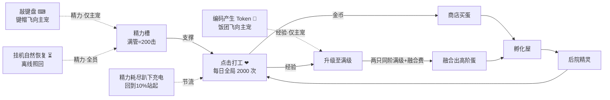

# Gulugulu 交互经济设计文档（点击成长 · 精力体系 · 键盘充能）

> 版本 v2.0 · 2026-07-14 · 取代 `CoreGameplay.md` v1.0 中 §3.3（三种成长途径）与 §5（打工与精力）的全部规则；`CoreGameplay.md` 已同步修订为 v1.1 并指向本文
> 数值均为可调常量，权威定义集中在 §8；对新需求的逐条映射与设计新增见 §10
> ⚠️ **2026-07-20 数值口径更新（EconomyScaling v1.3）**：点击金币公式回到本文 §4.1 的 `(1+等级)×tierFactor`（中间曾短暂翻倍为 `2+2L`）；但本文其余常量已被后续版本取代——现行为 `dailyClickCap=1000`（非 2000）、`staminaPerClick=2`（满管 = 100 击）、`clickExpBase=4`、`tokensPerStaminaBase=80`（非本文与 EconomyScaling 定稿写的 8）、`levelExpFactor=[4,10,45,250,1600,11250]`、`maxLevel=[10..60]`（融合 2.0 扩到 6 阶）。**满级点击阶梯 45/95/196/390/784/1593 是 v1.3 起的设计输入**（[EconomyScaling.md](EconomyScaling.md) §2.1），`levelExpFactor` 只是它的反解值——改数值请从点击阶梯出发，别直接动 factor。§8 总表与 §6 UI 文案（"2000/2000"）为 v2.0 历史快照，**权威值以 `config.json` 与 [EconomyScaling.md](EconomyScaling.md) v1.3 §10 为准**。
> ⚠️ **2026-07-21 机制修订（Token→经验）**：**Token 不再回复精力**——编码 Agent 产出的 Token（四分加权口径不变：`cache_read/cache_create/output/input = 0.1/1/5/1`）直接折算为**当前陪伴宠（主宠）的经验**（`tokensPerExp = 40` 加权单位/点，**全阶统一、不乘 tierFactor**；`tokensPerStaminaBase` 配置键随之删除，上一条 2026-07-20 注记里的 Token→精力口径、以及 §3.3/§8 的 Token 精力换算均作废）。精力自此只剩两条来源：**挂机自然恢复**（全员）+ **敲键盘**（只喂主宠，溢出转移一并删除）；**漫游零食整条移除**（漫游只是散步）。陪伴宠满级或缺席时 Token **整段浪费、绝不溢给他宠**。经济不变量随之更新：金币仍只来自点击；**经验新增第二条水龙头 = Token 喂养（只入陪伴宠）**。受影响处（§1/§2/§3.3/§3.4/§3.5/§4.4/§5/§6.3/§8/§9/§10）已就地订正。

## 1. 概述与设计目标

v1.0 的三条并行成长途径（挂机 / 点击 / 吃 Token）让成长大量发生在后台：宠物"自己就长大了"，点击沦为副业，Token 喂食的收益也无从感知。本次重构把体验收拢成一条清晰主线：

> **AI 干活喂经验，你亲手点击赚金币。**

四个系统角色：

| 角色 | 系统 | 一句话 |
|---|---|---|
| **燃料** | 精力（两种来源：挂机 / 敲键盘，键盘只喂主宠） | 你工作，它充电 |
| **喂养器** | AI 产出的 Token → 当前陪伴宠经验（`tokensPerExp=40`，全阶统一） | AI 干活，它涨经验 |
| **转化器** | 点击打工（唯一的**金币**水龙头，兼经验来源之一） | 金币永远发生在你手里 |
| **节拍器** | 每日全局 2000 次点击额度 | 今天的爱有额度，明天还想继续 |

设计支柱：

1. **金币必须亲手发生，经验以点击为主**：金币只从点击进入游戏，被"每日额度 × 精力"双重约束；经验有两条水龙头——**点击打工**（亲手、全宠可得）与 **Token 喂养**（AI 产出直灌当前陪伴宠，仅此一只，满级或缺席即浪费、绝不溢给他宠）。挂机、键盘只产精力，精力自封顶（上限即满管）。除点击金币与陪伴宠的 Token 经验外，后台行为不再直接产出成长。
2. **一切数值变化看得见飞进来**：视觉语法——**向内汇聚 = 喂养输入**（键帽飞向宠物 = 喂精力；Token 饭团飞向**陪伴宠** = 喂经验），**向外发散 = 收益读数**（金币 / 经验 ✨飘字、工具粒子从宠物身上迸出）。喂养飞行永远向内，收益飘字永远向外。
3. **上限与恢复期用"爱与休息"叙事**：额度是"今天能给它的爱"，恢复期是"趴着充电"；全程不出现红色禁止、错误提示或惩罚感。
4. **品阶即身价**：越高阶的宠物，喂饱它越贵（恢复需求 ×5/阶），但每一击的回报也越高（点击收益 ×5/阶）——同一份日额度，投给谁是玩家的分配策略。

## 2. 核心循环

孵化 / 商店 / 融合 / 后院 / 放生等外围循环不变（见 `CoreGameplay.md` §4/§6/§7/§8）。

## 3. 精力体系

### 3.1 精力 = 点击次数

- 每只精灵独立精力，上限 `staminaMax = 200`，**每次点击消耗 1 点**（`staminaPerClick = 1`）——满管精力恰好支撑 200 次点击，精力条即"剩余点击次数"，无需换算。
- 精力按 `staminaUpdatedAt` 时间戳惰性结算（清醒 / 睡眠 / 离线同速回复），无 tick 依赖；时间戳晚于当前时刻时钳回（时钟回拨防呆）。

### 3.2 10% 迟滞唤醒

- 精力打到 **0**：进入 `exhausted` 恢复期——趴下充电（lie 姿态 + 💤 + 内嵌恢复进度条），**拒绝打工点击**（有温柔的驳回演出，非报错）。
- 恢复到 **≥ 10%**（`wakeThreshold = 20`）：站起、恢复接受点击（伸懒腰唤醒演出）。
- 两个阈值构成迟滞区间：醒着时精力从 200 → 1 全程站立可点；只有真正打空才休息，且每次醒来至少有 20 击可用，避免高频睡醒循环。
- 恢复期间**键帽照飞照吸收**：敲键盘（喂精力，仅主宠）与挂机回复照常累积，喂到 ≥20 会直接被"喂醒"。Token 饭团在恢复期照样飞来，但它**只涨经验、不碰精力，不参与喂醒**（趴着充电时也能继续涨经验）。

### 3.3 恢复两途径与品阶缩放

统一缩放系数 `tierFactor(tier) = tierGrowthFactor^(tier−1)`，`tierGrowthFactor = 5`。回满一管（200 点）所需：

| 途径 | 换算（每 1 点精力） | 1 阶回满 | 2 阶回满 | 3 阶回满（预留） |
|---|---|---|---|---|
| 挂机自然恢复（全员各自结算） | `staminaRegenSecondsBase(3s) × tierFactor` | **10 分钟** | 50 分钟 | ~4.2 小时 |
| 敲键盘（**只喂主宠**） | `keysPerStaminaBase(1) × tierFactor` 次按键 | **200 键** | 1000 键 | 5000 键 |

> ⚠️ **2026-07-21 机制修订**：原「恢复三途径」的第三条 **吃 Token 回精力已删除**——Token 移出精力体系，改为直接喂**当前陪伴宠（主宠）的经验**（见下「Token → 经验」）。精力自此只剩上表两途径：挂机（全员独立结算）+ 敲键盘（只喂主宠）。

- 两途径**叠加生效**，敲键盘的小数进度存每宠整数缓冲 `keyBuffer`，不丢余数。
- 高阶宠精力"胃口大"仍是刻意的身价设计（回满 ×5/阶）：想持续点 2 阶（每击 5 倍收益），除了等挂机慢慢回，唯一的主动加速是**多敲键盘**——Token 已不再补精力。

**Token → 经验（2026-07-21 起，取代原"吃 Token 回精力"）**：编码 Agent 产出的 Token 直接折算为**当前陪伴宠（主宠）的经验**，不再回精力。

- **口径 = 四分加权喂养单位**（沿用既有，2026-07-21 未改）：`cache_read / cache_create / output / input = 0.1 / 1 / 5 / 1`，四分全吃、按权求和为「加权喂养单位」。
- **换算 `tokensPerExp = 40`**（加权单位/点经验，测试配置 1）：每 40 个加权单位 = 1 点经验，**全阶统一、不乘 tierFactor**——经验体系本身已按阶放大（`clickExpBase × tierFactor`、`levelExpFactor`），Token 换算再乘一次会双重缩放。
- **40 的由来**：等于旧「Token→精力→点击」链的点击等价换算——`tokensPerStaminaBase(80) × staminaPerClick(2) ÷ clickExpBase(4) = 40`（现行 `clickExpBase = 4`，见头部注记；即产出约 160 加权单位 ≈ 亲手点一下攒的经验），成长节奏与 v1.3 点击养成持平。
- **只喂陪伴宠、绝不外溢**：Token 经验只入当前陪伴宠；**陪伴宠满级或缺席 → 整段 Token 浪费**，绝不溢给其他宠（用户明确决策）。换算余数存 `pet.tokenBuffer`（语义由"精力进度"改为"经验进度"）。
- **不产金币、不占额度**：Token 喂养不产任何金币，也不消耗 `dailyClickCap` 点击额度。
- **口径沿革**：raw（v1.1，整段上下文重放虚灌）→ 产出 token（v1.2，2026-07-18）→ 四分加权（v1.3）→ **喂经验（2026-07-21）**。早先把 Token 折成精力时"一轮认真干活的回复 ≈ 一顿正餐"的数值意图，如今平移为"≈ 亲手点几下攒的经验"。

### 3.4 能量喂养目标（无溢出）

**敲键盘的精力只喂主宠（当前陪伴宠），不再溢出转移**：主宠满管后，多余键次**直接丢弃**（UI 轻提示"精力已满"，不折金币、不转他宠——金币只能来自点击）；主宠缺席（无出战宠）时键次同样浪费。挂机恢复仍是各宠独立结算，与喂养无关。

> ⚠️ **2026-07-21 修订**：① 原「主宠满 → 溢出最低未满宠 → 全员满丢弃」的三级溢出链**整条删除**，键盘精力只认主宠一只；② Token 已移出精力体系（改喂主宠经验，见 §3.3），本节不再涉及 Token——Token 经验同样只入主宠、满级或缺席即浪费、绝不外溢。

### 3.5 ~~漫游零食~~（2026-07-21 移除）

> ⚠️ **2026-07-21 移除**：漫游零食**整条删除**——`wander_snack` 命令/逻辑、`wanderSnack*` 配置键、`daily.snackStamina` 计数全部移除。主宠自主漫游**不再产出任何东西**（不捡金币、不捡精力），漫游只是散步。
>
> 历史沿革（保留备查）：v1.0 漫游捡币 → v1.1 改漫游零食（主宠 +2~5 点精力、日上限 20 点）→ 2026-07-21 彻底移除。

## 4. 点击成长

### 4.1 收益公式（唯一的金币水龙头，兼经验来源之一）

> ⚠️ **2026-07-21 修订**：**金币**仍是点击独占的唯一水龙头；**经验**自 2026-07-21 起多了第二条水龙头——Token 喂养（只入当前陪伴宠，见 §3.3）。本节只讲点击这一侧的结算。

每次有效点击（消耗 1 精力）同时结算：

| 产出 | 公式 | 1 阶 | 2 阶 |
|---|---|---|---|
| 经验 | `clickExpBase(2) × tierFactor` | 2 / 击 | 10 / 击 |
| 金币 | `(clickCoinsBase(1) + clickCoinsPerLevel(1) × 等级) × tierFactor` | Lv1=2，Lv10=11 | Lv1=10，Lv20=105 |

- 满级精灵的点击不再产经验，金币照发（图鉴保底手感），仍计入日额度。
- 原 `clickCoinsPerTier`（+10/阶的加法项）与点击金币日软上限（1500/3000 减半/减 75%）**移除**——防刷职责由日额度统一承担。

### 4.2 每日额度（全局 1000 次）

- `dailyClickCap = 1000`：**账号级**每日有效点击总数，跨宠共享，由玩家自由分配（存档 `daily.clicks` 计数，本地日期翻转清零）。
- **计数规则**：每一次消耗精力的点击都 +1（含满级宠的纯金币点击）。
- **额度用尽后 = 纯抚摸模式**：点击不消耗精力、无任何数值产出，只播粉色爱心特效与温馨气泡（"今天被爱得饱饱的"）。不禁点、不报错。
- 额度体量参照：1000 击 ≈ 10 管精力（`staminaMax 200 ÷ staminaPerClick 2` = 100 击/管）≈ 满额约可点满 22 只 1 阶（各 45 击）或 10 只 2 阶（各 95 击）——上限宽裕，真实节流是精力循环与玩家耐心；1000 是防自动连点器的硬顶，不是日常体感墙。
- > **口径沿革**：本节定稿为「2000 击 × 每击 1 精力」；实装为 **「1000 击 × 每击 2 精力」**（精力总量等价，见 `EconomyScaling.md` §9）。全文按实装值。

### 4.3 等级曲线

> **权威定义已上移到 [EconomyScaling.md](EconomyScaling.md) §2.1（v1.3）**：设计输入是「点满一只 T 阶宠要几下」，钉成 ×2 阶梯 **45/95/196/390/784/1593 击**；`levelExpFactor = [4, 10, 45, 250, 1600, 11250]` 是反解出的从属量，`maxLevel = [10,20,…,60]` 不变。本节只留 1~2 阶的手感说明。

每击经验 = `clickExpBase × 5^(阶−1)` = `4 × 5^(阶−1)`：

| 阶 | 升 Lv n+1 需 | 满级累计 | 换算成点击 |
|---|---|---|---|
| 1 阶 | `4 × n` | 180 exp | **45 击**（不到半管精力） |
| 2 阶 | `10 × n` | 1900 exp | **95 击**（约一管精力） |

一只 2 阶从融合到满级的全程 ≈ 两只 1 阶（90 击）+ 融合 + 95 击 ≈ 185 击，一个认真的游戏日可完成好几轮。

> **沿革**：本节曾定为 `[10, 50]` + 每击 `2×5^(阶−1)`（225 / 950 击），后实现侧改成 `[5, 50]` + 每击 `4×5^(阶−1)`（57 / 475 击）。两版都让 1→2 阶点击数跳 4~8 倍，二阶「点到满级好久」的体感由此而来；v1.3 统一按点击阶梯反解，见 EconomyScaling §2.1。

### 4.4 经济不变量与 Steam 合规

- **不变量**（进代码注释与单测）：**`coins` 只在 `logic_click_work` 中增加**，且必经 `dailyClickCap` 与精力双重闸门；**`exp` 只在两处增加——`logic_click_work`（点击，全宠）与 `logic_feed_tokens`（Token 喂养，只加当前陪伴宠）**；`logic_feed_keys` / `settle_pet` 只改精力与缓冲，绝不触碰 `coins`/`exp`。（2026-07-21：经验闸门由"仅点击"放宽为"点击 + Token"；`logic_feed_energy` 已拆为 `logic_feed_keys` / `logic_feed_tokens`，零食路径整条删除。）
- 金币仍是**纯本地货币**，符合 `plans/steam_trade/00-decisions.md` 安全不变量：可交易宠物供给仍只来自 Steam playtime 掉落与融合销毁，本次重构未新增任何可交易资产水龙头（相比 v1.0 反而减少了金币水龙头：4 个 → 1 个）；**2026-07-21 的 Token→经验也只涨等级、不产金币、不产可交易资产，合规不受影响**。
- **遗留旗标**：保留等级加成后，2 阶满级理论日收入上限 ~21 万金，现行商店物价（蛋 80–150 / 升级 200–1200 / 融合 100）需要后续单独调价 pass——本期不动物价，先观察真实收入曲线。

## 5. 键盘充能（新玩法）

### 5.1 规则

- **系统级监听**（Windows 低级键盘钩子，应用不聚焦也生效——玩家在编辑器里打字，宠物在旁边"接住"每个键）：每次按键下压计 1 次，按 §3.3 换算成精力**喂给主宠**（只喂主宠，满管即丢弃，无溢出转移；详见 §3.4）。
- **防刷三闸**：① 按住不放的自动重复不计（pressed-set：一次按下只计一次，直到抬起）；② 计数限速 `keyRateCapPerSec = 15` 次/秒（令牌桶，超出的键既不计数也不出特效）；③ 精力自封顶——即使无限敲键，成长仍被点击额度锁死。
- **事件节拍**：按键标签每 250ms 批量推给前端做键帽特效；精力每 1s 结算入账一次。
- 输入法（IME）兼容：按物理键位去重，中文输入连打每键照计；无法识别的键显示 ⌨ 通用键帽。

### 5.2 隐私承诺（写入 README 与设置页）

- **只统计次数**：游戏逻辑只接收"这 1 秒按了 N 次键"的计数。
- **瞬时字符只用于特效**：按键字符仅在 ≤250ms 的批次内存在、用于渲染飞行键帽，**不写日志、不入存档、不落盘、不上传**。
- **随时可关**：托盘菜单"键盘充能"勾选项一键关闭 = 真实卸载系统钩子（非静默忽略）；开关状态持久化在本地设置文件。默认开启（核心恢复机制），首次运行以引导气泡告知。

### 5.3 平台范围

Windows 首发（与 `window_tracker.rs` 同款平台门控先例）；macOS / Linux 暂不装钩子（**该平台的精力恢复途径 2026-07-21 起就只剩挂机自然恢复**——Token 已改喂经验、漫游零食已删，无键盘钩子的平台没有任何主动回精力手段，是待观察的平台平衡项，见 §8 末待决注记），浏览器预览模式以页面内按键模拟等价逻辑。

## 6. 表现层规范

### 6.1 精力条（EnergyBar，四表面）

以现有菜单精力条（`.hud-stamina-*`）为母本抽出通用组件，变体 `hud / tag / float`：

- **色阶**：≥60% 绿（现绿渐变）；10–60% 橙（`is-low` 渐变，阈值从 25% 提到 60%，长管更早出现"过半"体感）；<10% 恢复期灰紫 + 填充端头呼吸微光（"正在充电"而非"死了"）。
- **10% 唤醒刻度**：轨道内竖向刻痕，位置 `wakeThreshold/staminaMax`；恢复期填充逼近刻度时闪烁（"快醒了"）。
- **获得脉冲**：**键盘入账**（含挂机回复）时精力条身亮白一跳；点击的 -1 不做逐击动画（只靠宽度过渡自然缩短）。**Token 入账不再脉冲精力条**——它涨经验，改由经验/等级 UI 反馈（`+N ✨经验` 飘字 + 经验条脉冲，见 §6.3）；漫游零食已删。
- **不常态显示（2026-07-14 修订）**：桌宠位（主窗口菜单收起）与后院里精力条**默认不显示**，保持画面干净；仅在**点击某宠 / 该宠精力入账**后短暂显示 ~2.6s 再淡出（后院驻留名牌与主角头顶浮条都走这条规则，一次只显示被交互的那只）。恢复期（趴卧充电）是例外：由 💤 充电药丸内嵌微条持续显示充电进度。
- **三个表面**：① 菜单 HUD 常驻条（菜单本身即"点击后"的管理视图，含刻度+脉冲+爱心计）；② 后院驻留伙伴名牌内嵌微条（点击该宠后短暂显示；满格时名牌图标换 ⚡ 作常态一瞥）；③ 后院主角头顶浮条（点击/入账后短暂显示）。主窗口桌宠位不再有常驻浮条——点击即开菜单，由 HUD 条呈现。

### 6.2 爱心计（每日额度呈现）

- 心形轮廓 + 底部向上液面填充，液面 = 剩余额度比例；>50% 粉红 / 10–50% 蜜橙 / <10% 暖金心跳 / **0 = 🌙 月亮徽章**（tooltip「今日的爱已点满 2000/2000」）。
- 位置：后院左下牌簇加一枚爱心牌（`❤ 1,240` 剩余数）；公告板「⚡ 今日 Token」行改为「❤ 今日点击 n/2000」；主窗口菜单 HUD 金币旁（仅图标+液面，数字进 tooltip）。
- 第 2000 击：全屏粉色心形彩带 + 爱心计翻转成月亮 + 气泡「今天的爱点满啦！剩下的明天继续💛」。**无金币奖励**（防通胀）。

### 6.3 汇聚飞行系统（FlightLayer，Token 能量饭团 / 键帽雨共用）

- **Token 能量饭团三幕（2026-07-14 重做，慢而明显 ~3s；2026-07-21 起结算的是经验、只喂当前陪伴宠）**：Token 回复是一次性大量回复，动画刻意放慢、放大，让玩家看清。① 从远处飘来一个**能量饭团（🍙 SVG）**（主窗口左上"从 Agent 的话里掉出来"，后院从上方飘入）→ ② 抛物线 **~1.9s** 慢慢汇聚到**嘴部**（双层：外层水平线性、内层垂直先扬后坠）→ ③ 飘到嘴边**缩小消失**，同帧陪伴宠做**夸张吃相**（`is-eating` 大口一咬→咽下→满足回弹，叠加 fed 咀嚼 ~1.7s）+ **`+N ✨经验` 飘字（`pop-exp`）+ 经验/等级条脉冲**（吃满一级叠 Lv UP 演出）+ 气泡「吃到 {来源} 的 {四分明细} Token，经验涨了！」。合餐：待播队列一次合并成一餐。
  - **陪伴宠满级 / 无出战宠时**：Token 整段浪费——饭团飞行可照播但落点无 `+N` 飘字、不涨经验、不外溢（调试投喂时弹 toast「我已经满级啦，Token 就当零嘴吃着玩～」）。
  - **食物体型按产出 token 量指数分档**（越多产出 = 越大的一餐；v1.2 起分档与 Toast 数字都用 `outputTokenDelta`，raw 口径会把每餐都撑成最大档）：`≤2k` 1 级 / `≤8k` 2 级 / `≤32k` 3 级 / …… ×4 每级，封顶 6 级；像素尺寸随级放大，高级加芝麻点缀与热气。
- **键帽雨（2026-07-14 调慢调近）**：复用 voltmouse 键帽原语（圆角矩 + 字符），从底边"从你的键盘跳出来"，**距离更短、速度更慢（~760–920ms）**飞到宠物身体中心偏上，便于看清键帽上的字符；落点化一颗 ⚡ 火花（键帽是"吸收"不是"吃"，不走嘴）。批内 95ms 错峰起飞；每批渲染 ≤6 枚（第 6 枚为堆叠键帽 + `×N` 角标），全局在飞 ≤12（超限最老一枚直接跳到落点火花）；每批只出一条合并 `+N 精力` 飘字（**键帽精力只喂主宠、满管即丢弃，2026-07-21 起无溢出转移**）。
- **风味键**：Enter `⏎` 1.35× 金面键帽 + 落点小星爆；Space `␣` 加宽键帽飞行 wobble；Esc 半程化烟（精力照算）；Backspace `⌫` 落点灰色小 poof。
- **打字风暴**：≥8 键/s 持续 3s → 宠物切 `working` 敲打姿态"陪你写代码"（全复用现有工作动画，零新增 rig），跌破 4 键/s 2s 后回落；恢复期不触发（键帽照飞，呼吸加深一拍"睡着也在吸收"）。
- 窗口隐藏时跳过特效（精力照算），恢复可见时一次补账脉冲。

### 6.4 姿态微演出

| 时刻 | 表现 |
|---|---|
| <10% 恢复期 | lie 趴卧 + 💤 药丸内嵌微型精力条（与夜间睡觉区分：夜睡无条无灰度） |
| 恢复到 10% 唤醒 | CSS 伸懒腰（身体 scaleY 1→1.07→1 + 双臂张开）+ ❗ 气泡 + 台词「睡饱啦！精力满上来了⚡」；后院伙伴同刻欢呼一次 |
| 满格邀约 | 头顶偶发金色 twinkle + 每 ~20s 自发小跳 + 名牌 ⚡满 徽标——充满电的宠物自己喊"点我" |
| 点击趴卧宠（驳回） | 翻身微动 + Zzz 放大一拍 + 气泡「嘘…让我睡会，快满 {n}% 啦」；**无粒子无飘字无报错** |
| 额度用尽后点击 | 纯爱抚：粉心 ReactionBurst + 轻微脉冲，每 ~15 击随机温馨气泡；无数字无连击 |

### 6.5 200 击长管节奏

原节奏为 20 击/管调校（每 10 连击 boom + 管末小跳），200 击下头重脚轻。重构为四级（以 `staminaMax − stamina` 存档值触发，跨会话稳定）：

| 里程碑 | 演出 |
|---|---|
| 每 10 连击 | boom 冲击环（现有，不变） |
| 50 / 100 / 150 击 | 精力条橙光扫过 + screen 级 boom + 宠物半跳 + 段落横幅「50 击！」「过半啦！」「最后冲刺！」 |
| 第 200 击（管空） | 大终结技：finisher 跳 + 三连 boom 错峰（0/0.12/0.26s）+ 精力条碎裂散星 + **收工结算横幅**「满工收工！本管 🪙+N ✨+N」（管级累计器）+ 缓缓趴下 |
| 连击视觉曲线 | 粒子密度上限保留，`--combo-scale` 封顶从 20 连击放宽到 40 |

人体工学：后院点击改 **pointerdown 即结算**（体感 -60ms，连点更跟手；主窗口保留 pointerup 以消歧拖拽）；**不做** hold 自动连点（违背"点击才有意义"）；200 击 ≈ 40–50s 连点，由 50 击段落 + 键帽雨/Token 餐穿插切成 4 段心理单元。

### 6.6 多宠一瞥

后院牌簇加一行「⚡ N 只精力满」，点击镜头平移到最近的满格伙伴；配合名牌 ⚡ 徽标，多宠精力管理一眼可读。

### 6.7 性能红线

全部飞行动画仅 `transform/opacity`；在飞键帽 ≤12、Token 芯片 ≤2；`prefers-reduced-motion` 降级为直出飘字；`document.hidden` 零渲染只补账。

## 7. 玩法完善路线

- **P1（下迭代）**：满格开点的前 20 击金色描边光环（纯表现无数值）；每日首击仪式（大心形 + 「早安！今天也有 2000 下的爱」）；Token 餐 S/M/L 完整化；图鉴/名牌 tooltip「今日已投入 n 击」（需 per-pet 日计数字段）。
- **P2（点子池）**：桌面级键雨（复用 fx 覆盖层按需显示，键帽从屏幕物理底边飞向宠物窗口）；夜间 22:00–7:00 睡帽；500/1000/2000 日击纯装饰彩带；后院"按住拖蹭"揉搓手势（原型验证后再排期）。
- **明确不做**：hold 自动连点（伤"点击才有意义"）；额度倒计时数字常显（焦虑感）；恢复期全屏灰罩（惩罚感）。

## 8. 数值总表（权威定义，全部集中在 Rust 侧 `GameConfig`）

| 参数 | 键 | 正式值 | 测试值 |
|---|---|---|---|
| 阶乘数 | `tierGrowthFactor` | 5 | 5 |
| 精力上限（=满管点击数） | `staminaMax` | 200 | 20 |
| 每击耗精力 | `staminaPerClick` | 1 | 1 |
| 挂机恢复基准（秒/点，×tierFactor） | `staminaRegenSecondsBase` | 3 | 1 |
| 唤醒阈值（10%） | `wakeThreshold` | 20 | 2 |
| 点击经验基准（×tierFactor） | `clickExpBase` | 2 | 2 |
| 点击金币 | `clickCoinsBase` + `clickCoinsPerLevel`，`(1+1×等级)×tierFactor` | 1 + 1 | 1 + 1 |
| 每日点击额度（全局） | `dailyClickCap` | 2000 | 30 |
| 键盘换算基准（键/点，×tierFactor） | `keysPerStaminaBase` | 1 | 1 |
| 键盘计数限速（次/秒） | `keyRateCapPerSec` | 15 | 5 |
| Token→经验换算（加权喂养单位/点经验，**全阶统一，不乘 tierFactor**；2026-07-21 取代 `tokensPerStaminaBase`） | `tokensPerExp` | 40 | 1 |
| 等级曲线（升 Lv n+1 = factor×n） | `levelExpFactor` | [10, 50] | [2, 3] |
| 满级 | `maxLevel` | [10, 20] | [4, 6] |

**移除的常量**：`clickCoinsPerTier`、`clickSoftCap1/2`、`mainExpPerTick`、`yardTicksPerExp`、`coinTicksPerCoin`、`idleCoinDailyCap`、`wanderCoinMin/Max/DailyCap`、`tokenExpDailyCap`、`overflowCoinDailyCap`；**2026-07-21 追加移除**：`tokensPerStaminaBase`（Token 改喂经验，换算键换成 `tokensPerExp`）、`wanderSnackStaminaMin/Max`、`wanderSnackDailyCap`（漫游零食整条删除），以及存档 `daily.snackStamina` 计数。其余（初始金币 / 蛋价 / 孵化时长 / 融合 / 孵化屋 / 后院 / 放生返还 / 物种表）不变，见 `CoreGameplay.md` §9。

**节奏验证（v1.3 重算）**：开局教学蛋孵出咕噜鸭（满精力 200 = 100 击）→ **45 击即亲手满级**（180 exp、+330 金），一管精力还剩 55 击 → 买蛋孵第二只，同样 45 击点满 → 首次融合（1500 金）开局当天达成。2 阶满级 **95 击**（约一管），是当天而非次日就能完成的目标。
> ⚠️ **待决**：本段原设计依赖「一阶满级 225 击 > 一管 200 击」⇒ 玩家**必然**在教学期打空精力、自然触发键盘回精力教学。v1.3 后一阶满级只要 45 击（< 100 击/管），**该触发前提失效**——`OnboardingCoach.md` 的 CE 精力恢复插播需要重新安排时机（顺延到二阶养成期，或教学期临时压低精力上限）。本次只标记，不改触发机制。
>
> ⚠️ **2026-07-21 补充**：Token 退出精力体系后，**主动回精力只剩敲键盘一途**（挂机是被动等待，漫游零食已删；无键盘钩子的 macOS/Linux 更是只剩挂机）。这让"键盘回精力"从顺带教学升级为**必教**——玩家若只挂机不敲键盘，二阶起精力循环会明显吃紧。上一条 CE 插播重排因此更需尽早落地，平台差异（§5.3）也要在引导里点明。

## 9. 技术要点

- **2026-07-21 机制修订（Token→经验，不升存档版）**：`logic_feed_energy` 拆成 `logic_feed_keys` / `logic_feed_tokens`（`EnergySource` 枚举删除）——键盘走 `logic_feed_keys`（只加主宠精力、无溢出），Token 走 `logic_feed_tokens`（只加当前陪伴宠经验、满级/缺席浪费、不外溢）。新增 DTO `TokenFeedOutcome { petId, expGained, leveledUp, levelAfter, expAfter, wasted, fedBreakdown }`，同时作为新事件 `game://exp` 的载荷。`DailyCounters.snack_stamina` 与 `wander_snack` 命令/逻辑、`wanderSnack*` 配置一并删除；**存档无需升版**（去掉的字段 serde 忽略、缺的字段 `default` 兼容）。`stats.total_tokens_fed` 仍按**加权喂养单位**累计（成就阈值 1M/50M/1B 不变），夜猫子旗标两条喂养路径都保留；`stats.first_maxlevel_done` 在点击**与 Token 喂养**两条路径都会置位——纯靠写代码把陪伴宠喂到满级也能拿「首次满级」成就。
- **存档 v3 迁移**（`gulugulu-save.json`，`version: 2 → 3`）：全宠精力回满、清 `exhausted` 与缓冲、`daily` 重置为新结构 `{ date, clicks, snackStamina }`（**2026-07-21：`snackStamina` 计数删除，daily 收敛为 `{ date, clicks }`，靠 serde 兼容不升版**）；Token 账本从 experience 单位（1k 量子）换为**原始 token 数**（`lastSeenProjectTokens`，用进度存档 totalTokens 播种，不追溯不重复）；旧字段 `lastSeenProjectExperience` 保留序列化为空表一个版本（旧二进制该字段必填，缺失会静默重建存档——降级保险）。
- **PetInstance** 有 `keyBuffer` / `tokenBuffer`（serde default，旧档兼容）；**2026-07-21 起 `tokenBuffer` 语义由"精力换算余数"改为"经验换算余数"**（`tokensPerExp` 不足一点的部分），字段名与序列化不变。
- **事件面**：`codex://activity` 的 `petExpDelta/fedCoins` 替换为 `fedStamina/fedPetId`（**2026-07-21：`fedStamina` → `fedExp` + `fedLeveledUp`，`fedPetId` 保留 = 当前陪伴宠**）；`game://keys {labels[]}`（≤4/s，纯特效）不变；`game://stamina {source, perPet, wokePetIds}` 的 `source` **自 2026-07-21 恒为 `"keys"`**（Token 不再走这条）；**新增 `game://exp`（载荷 = `TokenFeedOutcome`）**，Token 喂养入账时推送，驱动经验飘字 / 经验条脉冲 / Lv UP。轻量补丁仍不推全量存档（`customSpecies` 体积大）。
- **键盘捕捉** `key_watcher.rs`：Windows `WH_KEYBOARD_LL` 专线程 + 消息泵；纯逻辑 `KeyBatcher`（scancode pressed-set 去重 / 令牌桶 / 静态 vk→标签表，禁用 ToUnicode 以保护 IME）可单测；开关持久化 `gulugulu-settings.json`；关闭=真实摘钩。
- **60s tick 缩减**：不再产任何经验/金币，只负责精力结算 + 日期翻转 + `game://state` 推送刷新 UI。
- **mock 对等**：`mockEngine.ts` 与 `game.rs` 逐函数镜像（含迁移；**2026-07-21 起 `feedEnergy` 随之拆成 `feedKeys` / `feedTokens` 两个镜像函数**），浏览器预览以页内 keydown 模拟键盘链路。
- **v1.2 喂养口径切换（2026-07-18，raw → output tokens）**：progress 账本并行两账——`totalTokens`（raw，继续服务经验统计与历史折币）与新增 `outputTokens`（喂养口径，serde default 兼容旧文件）；`codex://activity` 事件面新增 `outputTokenDelta / projectOutputTokens`。存档字段 `lastSeenProjectTokens` 原地改存产出锚点：旧档 raw 基线（数十亿）必然大于产出累计，靠既有"总数回退自愈"在首个事件**静默换锚不喂养**，无迁移、无历史巨餐（单测 `ledger_v12_output_switchover_reanchors_without_megafeed`）。会话级 fallback 差分同样镜像一份 `sessionOutputTotals`（首见播种不喂）。
  - **2026-07-21 承接**：账本 / 锚点 / "静默换锚不喂养" / 会话 fallback 差分这套机制**整套保留**，只是差分的去向从"精力"改为"当前陪伴宠的经验"（`logic_feed_tokens` × `tokensPerExp=40`）。喂养口径本身已在 v1.3 从"纯产出"演进为"四分加权"（`0.1/1/5/1`）；单测名 `..._output_switchover_...` 仍指历史 v1.2 场景、语义仍成立（换锚不喂养），只是如今"喂"的是经验。
- **入账反馈闭环修复（v1.2 同批）**：① ~~Token 喂养成功后 Rust 端补发 `game://stamina {source:"tokens"}`~~ **（2026-07-21 改：Token 入账改推 `game://exp`，驱动经验飘字 / 经验条脉冲 / Lv UP；`game://stamina` 从此只服务键盘/挂机）**——轻量补丁管线仍在，此前 token 入账无即时反馈的问题由 `game://exp` 接手；② 进食演出播放门放行 `working/thinking`——Token 餐只在 Agent 活跃时产生，而活跃锁存恰好把宠物钉在这两个态，原先只许 idle 等于让演出整段会话饿死在队列里（**该门 2026-07-21 保留，只是载荷由精力变经验**）；③ 播餐加 6s 看门狗——`fed` 是可被点击/拖拽抢断的一次性态，被抢后队列会永久卡死（本会话再也不播进食），超时强制解锁复核。

## 10. 需求追踪与设计新增

### 10.1 需求逐条映射（2026-07-14 需求修订）

> ⚠️ **2026-07-21 更新**：下表第 1、2、7 行（Token 与精力相关）已被 2026-07-21 机制修订部分取代——Token 改喂**当前陪伴宠的经验**、精力恢复只剩挂机＋键盘、漫游零食删除。原行保留作历史，最新口径见 §10.3。

| 需求原文 | 落点 |
|---|---|
| 只有点击才会增长经验和获得金币 | §4.1 / §4.4（挂机经验、挂机产金、~~Token 经验~~、溢出折币、漫游捡币全部移除）→ **2026-07-21 更新**：金币仍点击独占；~~Token 经验~~ 于 2026-07-21 **恢复**为设计内水龙头（只入陪伴宠），本条现表述为「只有点击才产金币；经验 = 点击 ＋ Token」 |
| 挂机、吃 Token 只回复精力；Token 飞向角色 + 精力增长特效 | ~~§3.3 / §6.3~~ → **2026-07-21**：Token 改喂**经验**（非精力），精力只剩挂机 ＋ 键盘；Token 飞行改配 ✨经验飘字（§3.3 / §6.3） |
| 满管精力调整为 200 次点击 | §3.1（200 × 每击 1 点） |
| 每日全局最多 2000 次点击获取经验，玩家自行分配 | §4.2 |
| 键盘任意按键 → 带字符的键帽飞向宠物 + 恢复少量精力 | §5 / §6.3 |
| 有 10% 精力即站起接受点击，不再趴着 | §3.2 / §6.4 |
| 品阶恢复需求 ×5/阶（1 阶 10min/200键/2k Token），点击收益 ×5/阶 | §3.3 / §4.1 → **2026-07-21**：恢复只剩挂机 ＋ 键盘两途（删 Token 腿，1 阶 = 10min/200 键），点击收益 ×5/阶不变 |

### 10.2 设计新增与决策记录（用户已确认项标 ✅）

| 项 | 决策 |
|---|---|
| 额度用尽后的点击 | ✅ 纯抚摸模式（不耗精力、无产出、只有爱心特效） |
| 点击金币公式 | ✅ 保留等级加成：`(1+等级)×5^(阶−1)`；商店物价后续调价 pass（旗标） |
| 2 阶等级曲线 | ✅ `levelExpFactor` 25 → 50（满级 ≈950 击）→ **v1.3 全表按点击阶梯反解为 `[4,10,45,250,1600,11250]`，2 阶满级 95 击**（EconomyScaling §2.1） |
| 键盘捕捉默认状态 | ✅ 默认开启 + 托盘开关 + 首次引导告知 + 隐私承诺（§5.2） |
| 漫游捡币 | ~~改造为漫游零食（回精力），保留互动趣味且不违反金币铁律~~ → **2026-07-21：整条移除**，漫游不再产出任何东西（见 §3.5 / §10.3） |
| 能量溢出 | ~~主宠 → 最低未满宠 → 丢弃（不折金币）；"精力已满"轻提示~~ → **2026-07-21：溢出转移删除**，键盘精力只喂主宠、满管即丢弃；Token 已移出精力体系（见 §3.4 / §10.3） |
| 满级宠点击 | 仍产金币、计入额度（图鉴保底手感） |
| 旧防通胀机制 | 点击金币软上限 / Token 日上限 / 溢出折币全部移除，由日额度统一承担 |
| Token 喂养口径（2026-07-18 v1.2） | ✅ raw → **产出 token**（§3.3/§9）：cache 读写不再算"吃"，修复"打工中精力凭空回满"；入账即 `game://stamina` 脉冲反馈，进食演出在 working/thinking 也放行 → **2026-07-21：口径再演进为四分加权（v1.3），去向由精力改为当前陪伴宠的经验；入账改推 `game://exp`（经验脉冲/Lv UP），`game://stamina` 只留键盘/挂机（见 §10.3）** |

### 10.3 2026-07-21 机制修订（Token → 经验）

| 修订项 | 决策 |
|---|---|
| Token 去向 | Token 不再回精力，直接折算为**当前陪伴宠（主宠）的经验**（`tokensPerExp=40` 加权单位/点，**全阶统一、不乘 tierFactor**，见 §3.3）；不产金币、不占点击额度 |
| 陪伴宠满级 / 缺席 | Token **整段浪费**，绝不溢给其他宠（✅ 用户明确决策）；换算余数存 `tokenBuffer`（经验进度） |
| 精力恢复途径 | 收敛为**两条**：挂机（全员）+ 敲键盘（**只喂主宠**）；键盘溢出转移**删除**，满管即丢弃 |
| 漫游零食 | ✅ **整条移除**（命令 / 逻辑 / `wanderSnack*` / `daily.snackStamina` 全删）；漫游只是散步 |
| 经济不变量 | 金币只来自点击（不变）；经验 = 点击打工 ＋ Token 喂养（只入陪伴宠）；键盘 / 挂机只产精力 |
| 事件 / DTO | `logic_feed_energy` 拆为 `logic_feed_keys` / `logic_feed_tokens`；新 DTO `TokenFeedOutcome` = 新事件 `game://exp` 载荷；`codex://activity` `fedStamina`→`fedExp`+`fedLeveledUp`；`game://stamina.source` 恒 `"keys"`；存档不升版 |
| UI 表现 | Token 餐飘字＝`+N ✨经验`（`pop-exp`）、气泡＝「吃到 {来源} 的 {四分明细} Token，经验涨了！」；公告板行＝「🍙 Token→✨经验」（零食行删）；键帽雨仍 ⚡精力（只喂主宠）；首餐发现提示 localStorage 键改名 `gulugulu.tokenExpSeen` |
| 成就口径 | `total_tokens_fed` 仍按加权喂养单位累计（阈值 1M/50M/1B 不变）；夜猫子旗标两条喂养路径都保留；`first_maxlevel_done` 点击与 Token 喂养两路都置位（Token 喂满级也能拿「首次满级」） |
| 新手 / 毕业文案 | 恢复期＝「挂机 / 敲键盘 都在回精力⚡」；毕业＝「敲键盘回精力、AI 的 Token 喂我涨经验、点我打工赚金币」 |
